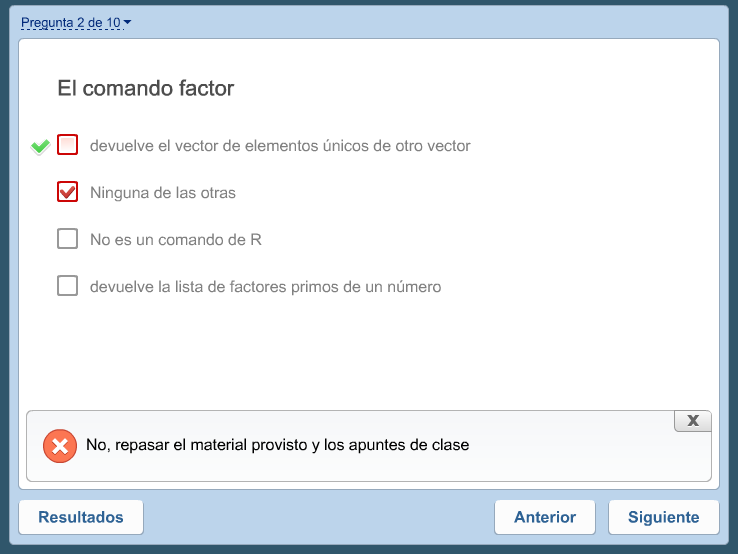
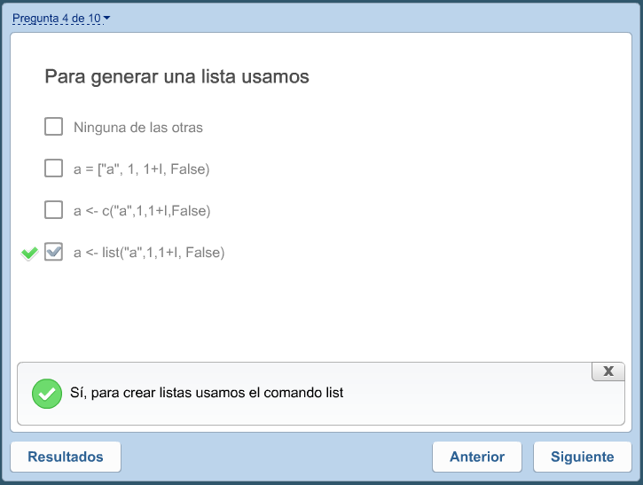

# Cuestionario Unidad 02

## Dudas en estas dos preguntas:
---
**Pregunta2**



El comando *factor* devuelve precisamente un _factor_, no un _vector_

Entonces la respuesta correcta sería: _Ninguna de las otras_

En todo caso *levels* o *unique* si retornan _vector_

``` R
> f <- factor(c("a", "a", "a", "b", "b", "c"))
> f
[1] a a a b b c
Levels: a b c
> class(f)
[1] "factor"
> str(f)
 Factor w/ 3 levels "a","b","c": 1 1 1 2 2 3
> levels(f)
[1] "a" "b" "c"
> unique(c("a", "a", "a", "b", "b", "c"))
[1] "a" "b" "c"
```

---
**Pregunta4**



La expresión _1 + I_ genera un error si no está definido I.

Entonces la respuesta correcta sería: _Ninguna de las otras_

``` R
> list("a", 1, 1+I, FALSE)
Error in 1 + I : argumento no-numérico para operador binario
```
---
