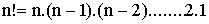
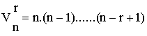
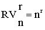
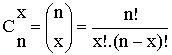
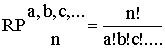

# Combinatoria

http://www.ub.edu/stat/GrupsInnovacio/Statmedia/demo/Temas/Capitulo1/B0C1m1t13.htm

 Veamos algunas fórmulas simples que se utilizan en combinatoria y que nos pueden ayudar a calcular el número de casos posibles o el número de casos favorables.
## Permutaciones
 Sea un conjunto de n elementos. A las ordenaciones que se pueden hacer con estos n elementos sin repetir ningún elemento y utilizándolos todos se las denomina permutaciones. 
 El número de permutaciones que se pueden realizar coincide con el factorial de n, y su cálculo es: n! = n . (n-1) . (n-2) . ... 2 . 1

 

 Ejemplo:
¿De cuántas maneras distintas podemos alinear a seis personas en una fila?
Respuesta:
De 6! = 6 * 5 * 4 * 3 * 2 * 1 = 720 maneras (permutaciones de 6 elementos).

```
factorial(6)
[1] 720
```

## Variaciones
 Sea un conjunto de n elementos. Supongamos que deseamos ordenar r elementos de entre los n. A cada una de estas ordenaciones la denominamos variación. 
 El número de variaciones que se pueden hacer de los n elementos tomados de r en r es: Vrn = n . (n-1) .... (n-r+1)

 

 Ejemplo:
 En una carrera de velocidad compiten diez atletas. ¿De cuántas maneras distintas podría estar formado el podio? 
 (el podio lo forman el primer, el segundo y el tercer clasificado)
 Respuesta:
 Cada podio posible es una variación de diez elementos tomado de tres en tres.
 Por tanto, el número posible de podios es: V 3 10 = 10 . 9 . 8 = 720

```
prod(seq(10,(10-3+1)))
[1] 720
```

## Variaciones con repetición
 Sea un conjunto de n elementos. Supongamos que se trata de ordenar r elementos que pueden estar repetidos. Cada ordenación es una variación con repetición. 
 El número de variaciones con repetición para un conjunto de n tomados de r en r es : RVrn = n ^ r

 

 Ejemplo:
 En una urna tenemos cinco bolas numeradas del 1 al 5. Se extraen tres bolas sucesivamente con reposición (devolviendo cada vez la bola a la urna). 
 ¿Cuántos resultados distintos es posible obtener?
 Respuesta:
 Se trata de variaciones con repetición de un conjunto de cinco bolas tomadas de tres en tres.
 En total tendremos: RV 3 5 = 5 ^ 3 = 125
 
```
5 ^ 3
[1] 125
```

## Combinaciones
 Cuando se trata de contar el número de subconjuntos de x elementos en un conjunto de n elementos 
 tenemos lo que se denomina combinaciones de x elementos en un conjunto de n. 
 El cálculo del contaje se hace mediante el número combinatorio, de la manera siguiente:
```
         (n)
 C x n = (x) = n! / x! . (n-x)!
```

 

 Ejemplo:
 ¿De cuántas maneras podemos elegir, en la urna anterior (recordemos que había cinco bolas), tres bolas en una única extracción?
 Respuesta:
 Serán combinaciones de cinco elementos tomados de tres en tres, por tanto, tendremos:
 
```
         (5)
 C 3 5 = (3) = 5! / 3! . (5-3)! = 10
factorial(5) / (factorial(3) * factorial(5-3))
[1] 10
```

## Permutaciones con repetición
 Sea un conjunto de n elementos, de entre los cuales tenemos a elementos indistinguibles entre sí, b elementos indistinguibles entre sí, c elementos indistinguibles entre sí, etc. 
 Cada ordenación de estos elementos se denominará permutación con repetición. El número de permutaciones con repetición es: RP a,b,c,... n = n! / (a! . b! . c! ...)

 

 Ejemplo:
 ¿Cuantas palabras con sentido o sin él pueden formarse con las letras PATATA?
 Respuesta:
 Tenemos tres veces la letra A, dos veces la T y una vez la P.
 Por tanto, serán: RP 3,2,1 6 = 6! / 3!.2!.1! = 60
 
```
factorial(6) / (factorial(3) * factorial(2) * factorial(1))
[1] 60

> factorial(170)
[1] 7.257416e+306
> prod(seq(170,1))
[1] 7.257416e+306
> 
```
