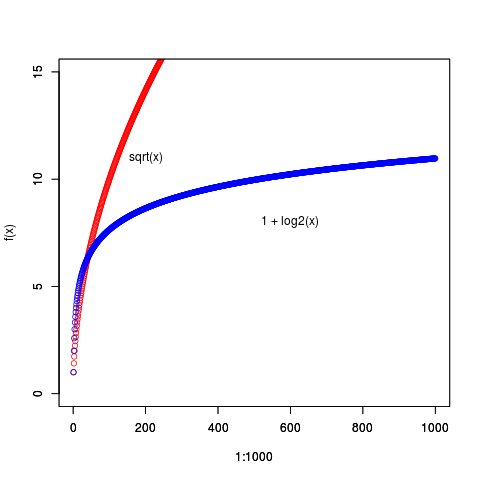

# Unidad 3
## Ejercicios base mascotas
``` R
> # Unidad 3

> file.exists("../descargas/unidad03/Mascotas_2a/ClasificacionProductos_csv.txt")
[1] TRUE
> ClasificacionProductos <- read.csv2("../descargas/unidad03/Mascotas_2a/ClasificacionProductos_csv.txt")
> head(ClasificacionProductos)
  Id IdProducto   Tipo
1  1          1   Vets
2  2          2   Vets
3  3          3   Vets
4  4          4   Vets
5  5          5   Vets
6  6          6 Jardín
> tail(ClasificacionProductos)
   Id IdProducto   Tipo
5   5          5   Vets
6   6          6 Jardín
7   7          7 Jardín
8   8          8 Jardín
9   9          9 Pileta
10 10         10 Pileta
> names(ClasificacionProductos)
[1] "Id"         "IdProducto" "Tipo"      
```
``` R
> ProductosxPagina <- read.csv2("../descargas/unidad03/Mascotas_2a/ProductosxPagina_csv.txt")
> head(ProductosxPagina)
  IdPágina IdProducto Tipo
1        1          9    3
2        2          8    2
3        3          2    1
4        4          9    3
5        5          7    2
6        6          7    2
> tail(ProductosxPagina)
   IdPágina IdProducto Tipo
15       15          9    3
16       16          6    2
17       17          9    3
18       18          1    1
19       19          7    2
20       20          4    1
> names(ProductosxPagina)
[1] "IdPágina"   "IdProducto" "Tipo"      

```
``` R
> Navegacion <- read.csv2("../descargas/unidad03/Mascotas_2a/Navegacion_csv.txt")
> head(Navegacion)
  Id IdDueño IdPágina          DT Secuencia Venta Importe
1  1       1        4 0.230000000         1     0       0
2  2       2       19 2.810000000        19     0       0
3  3       2        1 1.030000000      1-19     0       0
4  4       1        1 5.030000000         1     0       0
5  5       2        6 5.640000000         6     0       0
6  6       2       12 0.004689429      12-6     0       0
> tail(Navegacion)
             Id IdDueño IdPágina    DT Secuencia Venta Importe
1048568 1048568    3026       13  7.93   13-14-2     0       0
1048569 1048569    3026        5  1.85   5-13-14     0       0
1048570 1048570    3026       18  0.85   18-5-13     0       0
1048571 1048571    3026       11  0.32   11-18-5     0       0
1048572 1048572    3026       16 13.73  16-11-18     0       0
1048573 1048573    3027        2  7.96         2     0       0
> names(Navegacion)
[1] "Id"        "IdDueño"   "IdPágina"  "DT"        "Secuencia" "Venta"    
[7] "Importe"  
``` 
``` R
> Duenos <- read.csv2("../descargas/unidad03/Mascotas_2a/Duenos_csv.txt")
> head(Duenos)
  Id IdDueño Perros Gatos Total Edad Sexo Ingreso
1  5       1      1     2     3   60    M  116816
2  6       3      2    NA     2   76    M   16334
3  7       4      2    NA     2   43    F   34890
4  8       5     NA     1     1   36    M   38786
5  9       6      1    NA     1   63    F   22966
6 10       7      1    NA     1   74    F    8894
> tail(Duenos)
       Id IdDueño Perros Gatos Total Edad Sexo Ingreso
5660 5664    7994      1    NA     1   61    F   17830
5661 5665    7996      1     1     2   33    M   29813
5662 5666    7997     NA     2     2   65    M   12383
5663 5667    7998      3    NA     3   44    F   58143
5664 5668    7999     NA     2     2   40    F   38167
5665 5669      NA   7133  2867 10000   NA           NA
> names(Duenos)
[1] "Id"      "IdDueño" "Perros"  "Gatos"   "Total"   "Edad"    "Sexo"   
[8] "Ingreso"
```
``` R
> Mascotas <- read.csv2("../descargas/unidad03/Mascotas_2a/Mascotas_csv.txt")
> head(Mascotas)
  IdMascota IdDueño IdEspecie IdRaza  Peso  Edad Sexo
1         1    5627         1     89 11.81  0.01    M
2         2     398         1     40  7.78 12.64    M
3         3    1962         1     35  6.75  0.56    F
4         4    6113         2    170  6.40  7.07    F
5         5    1802         2    166  5.42  0.14    M
6         6    4092         1     36 18.82  0.29    M
> tail(Mascotas)
      IdMascota IdDueño IdEspecie IdRaza  Peso  Edad Sexo
9995       9995    4900         1     97 45.68  7.00    F
9996       9996    3424         1     94 30.22  6.81    F
9997       9997    6964         2    110  2.64 15.00    F
9998       9998    3092         1     31  7.59  6.22    M
9999       9999    4332         1     65 36.65 12.24    M
10000     10000    1460         2    127  2.13 14.20    M
> names(Mascotas)
[1] "IdMascota" "IdDueño"   "IdEspecie" "IdRaza"    "Peso"      "Edad"     
[7] "Sexo"     
> 
```

``` R
> paste(c("ClasificacionProductos : ", names(ClasificacionProductos)), collapse=" - ")
[1] "ClasificacionProductos :  - Id - IdProducto - Tipo"
> paste(c("ProductosxPagina : ", names(ProductosxPagina)), collapse=" - ")
[1] "ProductosxPagina :  - IdPagina - IdProducto - Tipo"
> paste(c("Navegacion : ", names(Navegacion)), collapse=" - ")
[1] "Navegacion :  - Id - IdDueno - IdPagina - DT - Secuencia - Venta - Importe"
> paste(c("Duenos : ", names(Duenos)), collapse=" - ")
[1] "Duenos :  - Id - IdDueno - Perros - Gatos - Total - Edad - Sexo - Ingreso"
> paste(c("Mascotas : ",names(Mascotas)), collapse=" - ")
[1] "Mascotas :  - IdMascota - IdDueno - IdEspecie - IdRaza - Peso - Edad - Sexo"
> 
```

# 1. Analisis exploratorio

Generar el histograma de la distribución de las ventas.

Identificar las páginas que más ventas produjeron.

``` R
> ## 1 Analisi exploratorio
> # Generar el histograma de la distribución de las ventas.
> # Identificar las páginas que más ventas produjeron.
> table(Navegacion[["IdPagina"]])

    1     2     3     4     5     6     7     8     9    10    11    12    13 
52430 52463 52534 52251 52127 52431 52279 52567 52274 52571 52362 52675 52379 
   14    15    16    17    18    19    20 
52579 52312 52489 52315 52752 52475 52308 
> table(Navegacion[["Venta"]])

     0      1 
988540  60033 
```
``` R
> head(Navegacion[Navegacion$Venta == 1 | Navegacion$Importe > 0 ,c(3,6,7)])
   IdPagina Venta Importe
35        2     1 2351.50
60       18     1 1262.19
73       19     1  569.55
85       11     1    0.00
87       10     1    0.00
91       18     1 2630.18
> head(Navegacion[Navegacion$Venta == 1 & Navegacion$Importe == 0 ,c(3,6,7)])
    IdPagina Venta Importe
85        11     1       0
87        10     1       0
179       20     1       0
192       20     1       0
194       15     1       0
292       10     1       0
> length(Navegacion[Navegacion$Venta == 1 & Navegacion$Importe == 0 ,c(7)])
[1] 16940
```
## Sobre cantidad de breaks
``` R
> sqrt(nrow(Navegacion))
[1] 1023.999
> sqrt(length(Navegacion[Navegacion$Venta == 1 | Navegacion$Importe > 0, c(7)]))
[1] 245.0163
> # [1] 245.0163 => breaks = 245
```
``` R
> 1 + log2(length(Navegacion[Navegacion$Venta == 1 | Navegacion$Importe > 0, c(7)]))
[1] 16.87347
> # [1] 16.87347 => breaks = 17
```
``` R
> hist(Navegacion[Navegacion$Venta == 1 | Navegacion$Importe > 0, c(7)],breaks=245, main="Venta = 1 o Impote > 0 \n incluye 16940 Venta = 1 e Importe = 0")
> hist(Navegacion[Navegacion$Venta == 1 | Navegacion$Importe > 0, c(7)],breaks=17, main="Venta = 1 o Impote > 0 \n incluye 16940 Venta = 1 e Importe = 0")
> hist(Navegacion[Navegacion$Venta == 1 | Navegacion$Importe > 0, c(7)],breaks="Sturges", main="Venta = 1 o Impote > 0 \n incluye 16940 Venta = 1 e Importe = 0")
```
``` R
> x <- sqrt(1:1000)
> plot(1:1000,x, ylim=c(0,15), col="red",ylab="f(x)")
> text(200,11, labels="sqrt(x)")
> par(new=TRUE)
> y <- 1 + log2(1:1000)
> plot(1:1000,y, ylim=c(0,15), col="blue", ylab="")
> text(600,8, labels="1 + log2(x)")
```


## Actividads Base Mascotas
1. Análisis exploratorio

. Generar el histograma de la distribución de las ventas. 

. Identificar las páginas que más ventas produjeron. 

## Histogramas
``` R
> hist(Navegacion[Navegacion$Venta == 1 | Navegacion$Importe > 0, c(7)],breaks=100, main="Venta = 1 o Impote > 0 \n incluye 16940 Venta = 1 e Importe = 0")
```


Hay una gran cantidad de ventas pequeñas, y muchas ventas con Importe = 0
``` R
> range(Navegacion$Importe)
[1]     0.00 15365.53
> min(Navegacion[Navegacion$Importe > 0 , 7])
[1] 0.01
```


``` R
> hist(Navegacion[(Navegacion$Venta == 1 | Navegacion$Importe > 0) & Navegacion$Importe < 2500, c(7)],breaks=100, main="Venta = 1 o Impote > 0 \n incluye 16940 Venta = 1 e Importe = 0 \n Importe < 2500")
```


Histograma de las ventas con importe > 0
``` R
> hist(Navegacion[Navegacion$Importe > 0, c(7)],breaks=100, main="Importe > 0")
```


Ventas x pagina
``` R
> # vantas por pagina
> # en total de Importe
> hist(Navegacion[Navegacion$Importe > 0, c(7)],breaks=150, main="Venta = 1 o Impote > 0 \n incluye 16940 Venta = 1 e Importe = 0",col=Navegacion$IdPagina)
> sort(unique(Navegacion$IdPagina))
 [1]  1  2  3  4  5  6  7  8  9 10 11 12 13 14 15 16 17 18 19 20
> ventasi_x_pg <- aggregate(Navegacion$Importe, by = list(IdPagina = Navegacion$IdPagina), FUN="sum")
> names(ventasi_x_pg) <- c("IdPagina", "TotalImporte")
+ ventasi_x_pg <- ventasi_x_pg[order(ventasi_x_pg$TotalImporte, decreasing=TRUE),]
```
``` R
> # vantas por pagina
> # en cantidad de ventas de importe > 0
> length(Navegacion$Importe[which(Navegacion$Importe > 0)])
[1] 43093
> ventasn_x_pg <- aggregate(Navegacion$Importe[which(Navegacion$Importe > 0)], by = list(IdPagina = Navegacion$IdPagina[which(Navegacion$Importe > 0)]), FUN="length")
> names(ventasn_x_pg) <- c("IdPagina", "CantVentas")
> ventasn_x_pg <- ventasn_x_pg[order(ventasn_x_pg$CantVentas, decreasing=TRUE),]
```
``` R
> # ventasn_x_pg
> # en cantidad de ventas = 1
> length(Navegacion$Importe[which(Navegacion$Venta == 1)])
[1] 60033
> ventasn1_x_pg <- aggregate(Navegacion$Importe[which(Navegacion$Venta == 1)], by = list(IdPagina = Navegacion$IdPagina[which(Navegacion$Venta == 1)]), FUN="length")
> names(ventasn1_x_pg) <- c("IdPagina", "CantVentas1")
> ventasn1_x_pg <- ventasn1_x_pg[order(ventasn1_x_pg$CantVentas, decreasing=TRUE),]
> # ventasn1_x_pg
```

Ventas por pagina, ordenadas por la suma de los importes 

TotImporte es la cantidad de Importes > 0

TotVentas es la cantidad de Venta == 1


``` R
> ventas_x_pg <- as.data.frame( cbind(ventasi_x_pg$IdPagina[order(ventasi_x_pg$IdPagina)], 
+                 ventasi_x_pg$TotalImporte[order(ventasi_x_pg$IdPagina)],
+                 ventasn_x_pg$CantVentas[order(ventasn_x_pg$IdPagina)],
+                 ventasn1_x_pg$CantVentas1[order(ventasn1_x_pg$IdPagina)]) )
> names(ventas_x_pg) <- c("IdPagina","SumImportes","TotImportes","TotVenas")
```
``` R
> ventas_x_pg[order(ventas_x_pg$SumImportes, decreasing=TRUE),]
   IdPagina SumImportes TotImportes TotVenas
4         4     3651141        2178     3013
18       18     3624026        2253     3191
12       12     3584630        2203     3060
1         1     3489205        2139     2945
14       14     3477520        2235     3074
17       17     3475739        2246     3104
16       16     3428532        2276     3105
6         6     3410362        2144     2973
15       15     3391075        2164     3040
7         7     3386140        2103     2943
2         2     3375899        2100     2961
11       11     3348423        2191     3041
13       13     3326757        2143     2904
8         8     3289032        2145     3028
10       10     3285845        2061     2949
5         5     3263901        2205     3029
9         9     3211731        2061     2853
3         3     3183446        2062     2895
19       19     3140510        2080     2911
20       20     3138998        2104     3014
> 
```

# 2. Correlaciones

Identificar los atributos de los dueños más correlacionados con las ventas

Identificar los atributos de las mascotas más correlacionados con las ventas

Identificar los atributos de la navegación más correlacionados con las ventas
``` R
> ## Correlaciones
> # a. Identificar los atributos de los dueños más correlacionados con las ventas
> # b. Identificar los atributos de las mascotas más correlacionados con las ventas
> # c. Identificar los atributos de la navegación más correlacionados con las ventas
> 
```
c.
``` R
> str(Navegacion)
'data.frame':	1048573 obs. of  7 variables:
 $ Id       : int  1 2 3 4 5 6 7 8 9 10 ...
 $ IdDueno  : num  1 2 2 1 2 2 2 2 2 2 ...
 $ IdPagina : num  4 19 1 1 6 12 4 11 9 9 ...
 $ DT       : num  0.23 2.81 1.03 5.03 5.64 ...
 $ Secuencia: Factor w/ 8420 levels "1","1-1","1-1-1",..: 1 4211 212 1 6737 1601 5976 1142 8058 8403 ...
 $ Venta    : num  0 0 0 0 0 0 0 0 0 0 ...
 $ Importe  : num  0 0 0 0 0 0 0 0 0 0 ...
> nrow(Navegacion)
[1] 1048573
> head(subset(Navegacion,select=c(IdPagina,IdDueno,DT,Venta, Importe)))
  IdPagina IdDueno          DT Venta Importe
1        4       1 0.230000000     0       0
2       19       2 2.810000000     0       0
3        1       2 1.030000000     0       0
4        1       1 5.030000000     0       0
5        6       2 5.640000000     0       0
6       12       2 0.004689429     0       0
```
``` R
> datos_cor <- subset(Navegacion,select=c(IdPagina,IdDueno,DT,Venta, Importe))
> cor(datos_cor, use="pairwise.complete.obs")
              IdPagina       IdDueno           DT         Venta       Importe
IdPagina  1.0000000000  0.0020068560 0.0009102326  0.0028936243 -0.0005175931
IdDueno   0.0020068560  1.0000000000 0.0001385579 -0.0008698551 -0.0049730214
DT        0.0009102326  0.0001385579 1.0000000000  0.3391152579  0.1766406628
Venta     0.0028936243 -0.0008698551 0.3391152579  1.0000000000  0.5215426827
Importe  -0.0005175931 -0.0049730214 0.1766406628  0.5215426827  1.0000000000
> # el atributo de Navegacion mas correlacionado con las ventas es DT
```
``` R
> # Secuencia solo se correlaciona levemente con IdPagina
> head(as.numeric(Navegacion$Secuencia))
[1]    1 4211  212    1 6737 1601
> head(subset(Navegacion,select=c(IdPagina,IdDueno, DT,Venta, Importe)))
> datos_cor <- subset(Navegacion,select=c(IdPagina,IdDueno,DT,Venta, Importe))
> head(datos_cor)
> datos_cor$Secuencia <- as.numeric(Navegacion$Secuencia)
> cor(datos_cor, use="pairwise.complete.obs")
               IdPagina       IdDueno           DT         Venta       Importe
IdPagina   1.0000000000  0.0020068560 0.0009102326  0.0028936243 -0.0005175931
IdDueno    0.0020068560  1.0000000000 0.0001385579 -0.0008698551 -0.0049730214
DT         0.0009102326  0.0001385579 1.0000000000  0.3391152579  0.1766406628
Venta      0.0028936243 -0.0008698551 0.3391152579  1.0000000000  0.5215426827
Importe   -0.0005175931 -0.0049730214 0.1766406628  0.5215426827  1.0000000000
Secuencia -0.2295237308 -0.0023354199 0.0002125272 -0.0005594549 -0.0010893389
              Secuencia
IdPagina  -0.2295237308
IdDueno   -0.0023354199
DT         0.0002125272
Venta     -0.0005594549
Importe   -0.0010893389
Secuencia  1.0000000000
> 
```
a.


