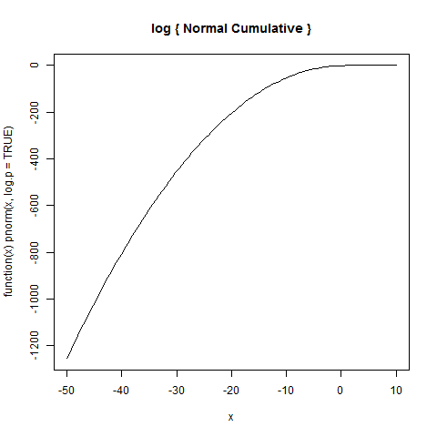
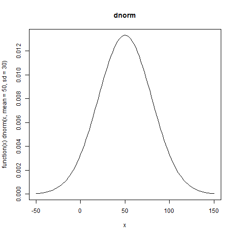
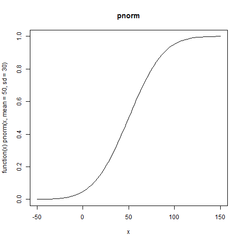
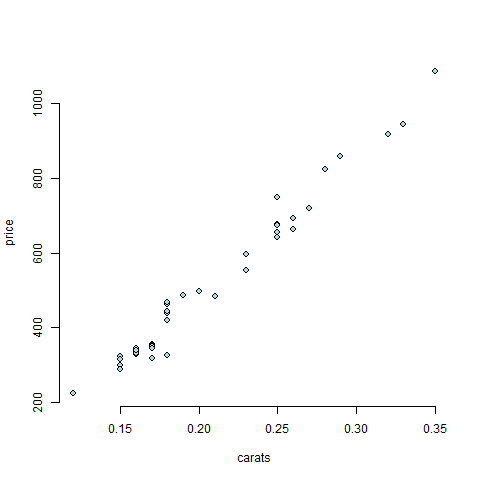
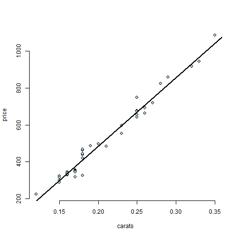
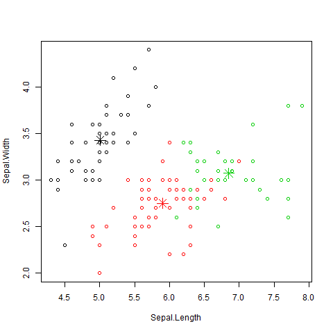

## Unidad 3
``` R
> # Unidad 3

> # Analisis exploratorio

> library(datasets)
> data(iris)
> str(iris)
'data.frame':	150 obs. of  5 variables:
 $ Sepal.Length: num  5.1 4.9 4.7 4.6 5 5.4 4.6 5 4.4 4.9 ...
 $ Sepal.Width : num  3.5 3 3.2 3.1 3.6 3.9 3.4 3.4 2.9 3.1 ...
 $ Petal.Length: num  1.4 1.4 1.3 1.5 1.4 1.7 1.4 1.5 1.4 1.5 ...
 $ Petal.Width : num  0.2 0.2 0.2 0.2 0.2 0.4 0.3 0.2 0.2 0.1 ...
 $ Species     : Factor w/ 3 levels "setosa","versicolor",..: 1 1 1 1 1 1 1 1 1 1 ...
> ls(all.names=TRUE)
[1] ".Random.seed" "iris"         "x"            "x01"          "xm"
> names(iris)
[1] "Sepal.Length" "Sepal.Width"  "Petal.Length" "Petal.Width"  "Species"
> str(iris[["Species"]])
 Factor w/ 3 levels "setosa","versicolor",..: 1 1 1 1 1 1 1 1 1 1 ...
> attributes(iris[["Species"]])
$levels
[1] "setosa"     "versicolor" "virginica" 

$class
[1] "factor"

> str(attributes(iris[["Species"]])$levels)
 chr [1:3] "setosa" "versicolor" "virginica"
> class(attributes(iris[["Species"]])$levels)
[1] "character"
> attributes(iris[["Species"]])$levels
[1] "setosa"     "versicolor" "virginica" 
> class(iris)
[1] "data.frame"
> nrow(iris)
[1] 150
> ncol(iris)
[1] 5
> names(iris)
[1] "Sepal.Length" "Sepal.Width"  "Petal.Length" "Petal.Width"  "Species"
> class(iris[["Sepal.Length"]])
[1] "numeric"
> range(iris[["Sepal.Length"]])
[1] 4.3 7.9
> table(iris[["Species"]])

    setosa versicolor  virginica 
        50         50         50 
> table(iris[["Sepal.Length"]])

4.3 4.4 4.5 4.6 4.7 4.8 4.9   5 5.1 5.2 5.3 5.4 5.5 5.6 5.7 5.8 5.9   6 6.1 6.2 
  1   3   1   4   2   5   6  10   9   4   1   6   7   6   8   7   3   6   6   4 
6.3 6.4 6.5 6.6 6.7 6.8 6.9   7 7.1 7.2 7.3 7.4 7.6 7.7 7.9 
  9   7   5   2   8   3   4   1   1   3   1   1   1   4   1 
> head(iris)
  Sepal.Length Sepal.Width Petal.Length Petal.Width Species
1          5.1         3.5          1.4         0.2  setosa
2          4.9         3.0          1.4         0.2  setosa
3          4.7         3.2          1.3         0.2  setosa
4          4.6         3.1          1.5         0.2  setosa
5          5.0         3.6          1.4         0.2  setosa
6          5.4         3.9          1.7         0.4  setosa
> attach(iris)
The following objects are masked from iris (pos = 3):

    Petal.Length, Petal.Width, Sepal.Length, Sepal.Width, Species

> # Analissi estadistico
> median(iris[["Sepal.Length"]])
[1] 5.8
> median(1:4)
[1] 2.5
> median(c(1:4,100,1000))
[1] 3.5
> # mean(x, trim = 0, na.rm = FALSE, ...)
> mean(iris[["Sepal.Length"]])
[1] 5.843333
> x <- c(0:10, 50)
> xm <- mean(x)
> c(xm, mean(x, trim = 0.10))
[1] 8.75 5.50
> # trim va de 0 a 0.5 indica que porcentage se recorta tanto de head como de tail
> # trim 0.01 en 100 observaciones quita la primera y la última
> x <- seq(0.1,10,0.1)
> str(x)
 num [1:100] 0.1 0.2 0.3 0.4 0.5 0.6 0.7 0.8 0.9 1 ...
> mean(log(x))
[1] 1.334809
> x01 <- x[2:99]
> x01
 [1] 0.2 0.3 0.4 0.5 0.6 0.7 0.8 0.9 1.0 1.1 1.2 1.3 1.4 1.5 1.6 1.7 1.8 1.9 2.0
[20] 2.1 2.2 2.3 2.4 2.5 2.6 2.7 2.8 2.9 3.0 3.1 3.2 3.3 3.4 3.5 3.6 3.7 3.8 3.9
[39] 4.0 4.1 4.2 4.3 4.4 4.5 4.6 4.7 4.8 4.9 5.0 5.1 5.2 5.3 5.4 5.5 5.6 5.7 5.8
[58] 5.9 6.0 6.1 6.2 6.3 6.4 6.5 6.6 6.7 6.8 6.9 7.0 7.1 7.2 7.3 7.4 7.5 7.6 7.7
[77] 7.8 7.9 8.0 8.1 8.2 8.3 8.4 8.5 8.6 8.7 8.8 8.9 9.0 9.1 9.2 9.3 9.4 9.5 9.6
[96] 9.7 9.8 9.9
> mean(log(x01))
[1] 1.36205
> mean(log(x), trim = 0.01)
[1] 1.36205
> # trim 0.1 en 100 observaciones quita las 10 primeras y las 10 últimas
> x10 <- x[11:90]
> x10
 [1] 1.1 1.2 1.3 1.4 1.5 1.6 1.7 1.8 1.9 2.0 2.1 2.2 2.3 2.4 2.5 2.6 2.7 2.8 2.9
[20] 3.0 3.1 3.2 3.3 3.4 3.5 3.6 3.7 3.8 3.9 4.0 4.1 4.2 4.3 4.4 4.5 4.6 4.7 4.8
[39] 4.9 5.0 5.1 5.2 5.3 5.4 5.5 5.6 5.7 5.8 5.9 6.0 6.1 6.2 6.3 6.4 6.5 6.6 6.7
[58] 6.8 6.9 7.0 7.1 7.2 7.3 7.4 7.5 7.6 7.7 7.8 7.9 8.0 8.1 8.2 8.3 8.4 8.5 8.6
[77] 8.7 8.8 8.9 9.0
> mean(log(x10))
[1] 1.485518
> mean(log(x), trim = 0.1)
[1] 1.485518
> # sd
> sd(iris[["Sepal.Length"]])
[1] 0.8280661
> sd(1:2) ^ 2
[1] 0.5
> summary(iris)
  Sepal.Length    Sepal.Width     Petal.Length    Petal.Width   
 Min.   :4.300   Min.   :2.000   Min.   :1.000   Min.   :0.100  
 1st Qu.:5.100   1st Qu.:2.800   1st Qu.:1.600   1st Qu.:0.300  
 Median :5.800   Median :3.000   Median :4.350   Median :1.300  
 Mean   :5.843   Mean   :3.057   Mean   :3.758   Mean   :1.199  
 3rd Qu.:6.400   3rd Qu.:3.300   3rd Qu.:5.100   3rd Qu.:1.800  
 Max.   :7.900   Max.   :4.400   Max.   :6.900   Max.   :2.500  
       Species  
 setosa    :50  
 versicolor:50  
 virginica :50  
                
                
```
                
``` R
> hist(iris$Sepal.Length,breaks=20)
```
 


``` R
> qqnorm(iris$Sepal.Length)
```


``` R
> boxplot(Petal.Length ~ Species , data = iris, ylab="Petal.Length", varwith=TRUE)
```


``` R
> plot(Petal.Length ~ Sepal.Length, data = iris, col = "red")
```


``` R
> pairs(iris)
```


``` R
> # Distribuciones
> pnorm(27.4, mean=50, sd=20)
[1] 0.1292381

> plot(function(x) pnorm(x, log.p = TRUE), -50, 10, main = "log { Normal Cumulative }")
```


```
> plot(function(x) dnorm(x, mean=50, sd=30), -50, 150, main = "dnorm")
```


```
> plot(function(x) pnorm(x, mean=50, sd=30), -50, 150, main = "pnorm")
```


```
plot(function(x) dnorm(x, mean=50, sd=30), -50, 150, main = "dnorm")
lines(c(27.4, 0))
```


``` R
> # Introduccion a la regresion lineal
> # install.packages("UsingR")
> library(UsingR)
Loading required package: MASS
Loading required package: HistData
Loading required package: Hmisc
Loading required package: lattice
Loading required package: survival
Loading required package: Formula
Loading required package: ggplot2

Attaching package: 'Hmisc'

The following objects are masked from 'package:base':

    format.pval, round.POSIXt, trunc.POSIXt, units


Attaching package: 'UsingR'

The following object is masked from 'package:survival':

    cancer

Warning messages:
1: package 'UsingR' was built under R version 3.2.5 
2: package 'HistData' was built under R version 3.2.5 
3: package 'Hmisc' was built under R version 3.2.5 
4: package 'survival' was built under R version 3.2.5 
5: package 'Formula' was built under R version 3.2.5 
6: package 'ggplot2' was built under R version 3.2.5 
> data(diamond)
> head(diamond)
  carat price
1  0.17   355
2  0.16   328
3  0.17   350
4  0.18   325
5  0.25   642
6  0.16   342
> summary(diamond)
     carat            price       
 Min.   :0.1200   Min.   : 223.0  
 1st Qu.:0.1600   1st Qu.: 337.5  
 Median :0.1800   Median : 428.5  
 Mean   :0.2042   Mean   : 500.1  
 3rd Qu.:0.2500   3rd Qu.: 657.0  
 Max.   :0.3500   Max.   :1086.0  
> plot(diamond$carat, diamond$price, xlab = "carats", ylab = "price", 
+                                    bg = "lightblue", col = "black",
+                                    cex = 1.1, pch = 21, frame = FALSE)
```


``` R
> lm(price ~ carat, data = diamond)

Call:
lm(formula = price ~ carat, data = diamond)

Coefficients:
(Intercept)        carat  
     -259.6       3721.0  

> plot(diamond$carat, diamond$price, xlab = "carats", ylab = "price", 
+                                    bg = "lightblue", col = "black",
+                                    cex = 1.1, pch = 21, frame = FALSE)
> abline(lm(price ~ carat, data = diamond),lwd=2)
```


``` R
> # el operador I 
> ?I
> class(diamond$carat)
[1] "numeric"
> class(I(diamond$carat - mean(diamond$carat)))
[1] "AsIs"
> class(diamond$carat - mean(diamond$carat))
[1] "numeric"
> fit2 <- lm(price ~ I(carat - mean(carat)), data = diamond)
> coef(fit2)
           (Intercept) I(carat - mean(carat)) 
              500.0833              3721.0249 
> x <- diamond$carat - mean(diamond$carat)
> fit2 <- lm(price ~ x, data = diamond)
> coef(fit2)
(Intercept)           x 
   500.0833   3721.0249 
> fit <- lm(price ~ carat, data = diamond)
> coef(fit)
(Intercept)       carat 
  -259.6259   3721.0249 
> newx <- c(0.16, 0.27, 0.34)
> coef(fit)[1] + coef(fit)[2] * newx
[1]  335.7381  745.0508 1005.5225
> predict(fit, newdata = data.frame(carat=newx))
        1         2         3 
 335.7381  745.0508 1005.5225 
> str(fit)
List of 12
 $ coefficients : Named num [1:2] -260 3721
  ..- attr(*, "names")= chr [1:2] "(Intercept)" "carat"
 $ residuals    : Named num [1:48] -17.95 -7.74 -22.95 -85.16 -28.63 ...
  ..- attr(*, "names")= chr [1:48] "1" "2" "3" "4" ...
 $ effects      : Named num [1:48] -3464.7 1448.7 -20.3 -82.6 -27 ...
  ..- attr(*, "names")= chr [1:48] "(Intercept)" "carat" "" "" ...
 $ rank         : int 2
 $ fitted.values: Named num [1:48] 373 336 373 410 671 ...
  ..- attr(*, "names")= chr [1:48] "1" "2" "3" "4" ...
 $ assign       : int [1:2] 0 1
 $ qr           :List of 5
  ..$ qr   : num [1:48, 1:2] -6.928 0.144 0.144 0.144 0.144 ...
  .. ..- attr(*, "dimnames")=List of 2
  .. .. ..$ : chr [1:48] "1" "2" "3" "4" ...
  .. .. ..$ : chr [1:2] "(Intercept)" "carat"
  .. ..- attr(*, "assign")= int [1:2] 0 1
  ..$ qraux: num [1:2] 1.14 1.1
  ..$ pivot: int [1:2] 1 2
  ..$ tol  : num 1e-07
  ..$ rank : int 2
  ..- attr(*, "class")= chr "qr"
 $ df.residual  : int 46
 $ xlevels      : Named list()
 $ call         : language lm(formula = price ~ carat, data = diamond)
 $ terms        :Classes 'terms', 'formula' length 3 price ~ carat
  .. ..- attr(*, "variables")= language list(price, carat)
  .. ..- attr(*, "factors")= int [1:2, 1] 0 1
  .. .. ..- attr(*, "dimnames")=List of 2
  .. .. .. ..$ : chr [1:2] "price" "carat"
  .. .. .. ..$ : chr "carat"
  .. ..- attr(*, "term.labels")= chr "carat"
  .. ..- attr(*, "order")= int 1
  .. ..- attr(*, "intercept")= int 1
  .. ..- attr(*, "response")= int 1
  .. ..- attr(*, ".Environment")=<environment: R_GlobalEnv> 
  .. ..- attr(*, "predvars")= language list(price, carat)
  .. ..- attr(*, "dataClasses")= Named chr [1:2] "numeric" "numeric"
  .. .. ..- attr(*, "names")= chr [1:2] "price" "carat"
 $ model        :'data.frame':	48 obs. of  2 variables:
  ..$ price: int [1:48] 355 328 350 325 642 342 322 485 483 323 ...
  ..$ carat: num [1:48] 0.17 0.16 0.17 0.18 0.25 0.16 0.15 0.19 0.21 0.15 ...
  ..- attr(*, "terms")=Classes 'terms', 'formula' length 3 price ~ carat
  .. .. ..- attr(*, "variables")= language list(price, carat)
  .. .. ..- attr(*, "factors")= int [1:2, 1] 0 1
  .. .. .. ..- attr(*, "dimnames")=List of 2
  .. .. .. .. ..$ : chr [1:2] "price" "carat"
  .. .. .. .. ..$ : chr "carat"
  .. .. ..- attr(*, "term.labels")= chr "carat"
  .. .. ..- attr(*, "order")= int 1
  .. .. ..- attr(*, "intercept")= int 1
  .. .. ..- attr(*, "response")= int 1
  .. .. ..- attr(*, ".Environment")=<environment: R_GlobalEnv> 
  .. .. ..- attr(*, "predvars")= language list(price, carat)
  .. .. ..- attr(*, "dataClasses")= Named chr [1:2] "numeric" "numeric"
  .. .. .. ..- attr(*, "names")= chr [1:2] "price" "carat"
 - attr(*, "class")= chr "lm"
> 
```

``` R
> # Introduccion a clustering
> newiris <- iris
> newiris$Species <- NULL
> head(newiris)
  Sepal.Length Sepal.Width Petal.Length Petal.Width
1          5.1         3.5          1.4         0.2
2          4.9         3.0          1.4         0.2
3          4.7         3.2          1.3         0.2
4          4.6         3.1          1.5         0.2
5          5.0         3.6          1.4         0.2
6          5.4         3.9          1.7         0.4
> kc <- kmeans(newiris, 3)
> class(kc)
[1] "kmeans"
> plot(newiris[c("Sepal.Length", "Sepal.Width")], col=kc$cluster)
> points(kc$centers[,c("Sepal.Length", "Sepal.Width")], col=1:3, pch=8, cex=2)
> 
```

