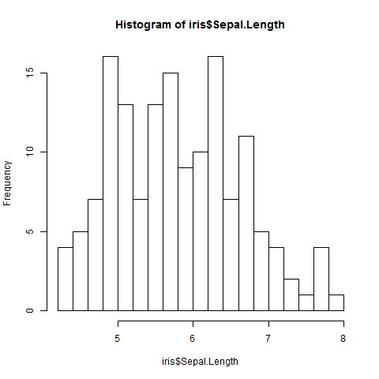
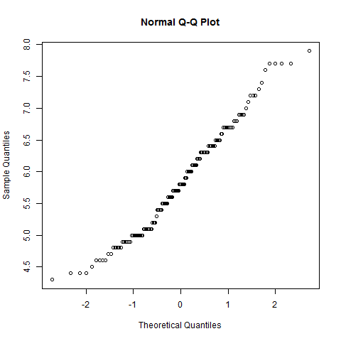
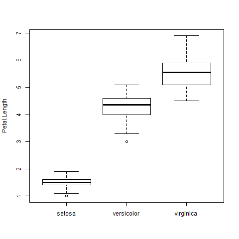
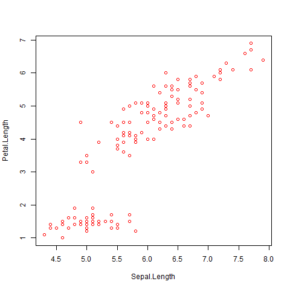
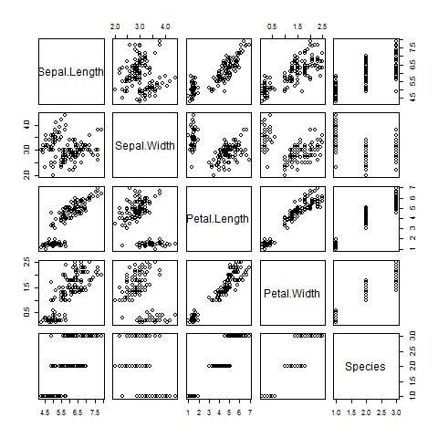

## Unidad 3
``` R
> # Unidad 3

> # Analisis exploratorio

> library(datasets)
> data(iris)
> str(iris)
'data.frame':	150 obs. of  5 variables:
 $ Sepal.Length: num  5.1 4.9 4.7 4.6 5 5.4 4.6 5 4.4 4.9 ...
 $ Sepal.Width : num  3.5 3 3.2 3.1 3.6 3.9 3.4 3.4 2.9 3.1 ...
 $ Petal.Length: num  1.4 1.4 1.3 1.5 1.4 1.7 1.4 1.5 1.4 1.5 ...
 $ Petal.Width : num  0.2 0.2 0.2 0.2 0.2 0.4 0.3 0.2 0.2 0.1 ...
 $ Species     : Factor w/ 3 levels "setosa","versicolor",..: 1 1 1 1 1 1 1 1 1 1 ...
> ls(all.names=TRUE)
[1] ".Random.seed" "iris"         "x"            "x01"          "xm"          
> names(iris)
[1] "Sepal.Length" "Sepal.Width"  "Petal.Length" "Petal.Width"  "Species"     
> str(iris[["Species"]])
 Factor w/ 3 levels "setosa","versicolor",..: 1 1 1 1 1 1 1 1 1 1 ...
> attributes(iris[["Species"]])
$levels
[1] "setosa"     "versicolor" "virginica" 

$class
[1] "factor"

> str(attributes(iris[["Species"]])$levels)
 chr [1:3] "setosa" "versicolor" "virginica"
> class(attributes(iris[["Species"]])$levels)
[1] "character"
> attributes(iris[["Species"]])$levels
[1] "setosa"     "versicolor" "virginica" 
> class(iris)
[1] "data.frame"
> nrow(iris)
[1] 150
> ncol(iris)
[1] 5
> names(iris)
[1] "Sepal.Length" "Sepal.Width"  "Petal.Length" "Petal.Width"  "Species"     
> class(iris[["Sepal.Length"]])
[1] "numeric"
> range(iris[["Sepal.Length"]])
[1] 4.3 7.9
> table(iris[["Species"]])

    setosa versicolor  virginica 
        50         50         50 
> table(iris[["Sepal.Length"]])

4.3 4.4 4.5 4.6 4.7 4.8 4.9   5 5.1 5.2 5.3 5.4 5.5 5.6 5.7 5.8 5.9   6 6.1 6.2 
  1   3   1   4   2   5   6  10   9   4   1   6   7   6   8   7   3   6   6   4 
6.3 6.4 6.5 6.6 6.7 6.8 6.9   7 7.1 7.2 7.3 7.4 7.6 7.7 7.9 
  9   7   5   2   8   3   4   1   1   3   1   1   1   4   1 
> head(iris)
  Sepal.Length Sepal.Width Petal.Length Petal.Width Species
1          5.1         3.5          1.4         0.2  setosa
2          4.9         3.0          1.4         0.2  setosa
3          4.7         3.2          1.3         0.2  setosa
4          4.6         3.1          1.5         0.2  setosa
5          5.0         3.6          1.4         0.2  setosa
6          5.4         3.9          1.7         0.4  setosa
> attach(iris)
The following objects are masked from iris (pos = 3):

    Petal.Length, Petal.Width, Sepal.Length, Sepal.Width, Species

> # Analissi estadistico
> median(iris[["Sepal.Length"]])
[1] 5.8
> median(1:4)
[1] 2.5
> median(c(1:4,100,1000))
[1] 3.5
> # mean(x, trim = 0, na.rm = FALSE, ...)
> mean(iris[["Sepal.Length"]])
[1] 5.843333
> x <- c(0:10, 50)
> xm <- mean(x)
> c(xm, mean(x, trim = 0.10))
[1] 8.75 5.50
> # trim va de 0 a 0.5 indica que porcentage se recorta tanto de head como de tail
> # trim 0.01 en 100 observaciones quita la primera y la última
> x <- seq(0.1,10,0.1)
> str(x)
 num [1:100] 0.1 0.2 0.3 0.4 0.5 0.6 0.7 0.8 0.9 1 ...
> mean(log(x))
[1] 1.334809
> x01 <- x[2:99]
> x01
 [1] 0.2 0.3 0.4 0.5 0.6 0.7 0.8 0.9 1.0 1.1 1.2 1.3 1.4 1.5 1.6 1.7 1.8 1.9 2.0
[20] 2.1 2.2 2.3 2.4 2.5 2.6 2.7 2.8 2.9 3.0 3.1 3.2 3.3 3.4 3.5 3.6 3.7 3.8 3.9
[39] 4.0 4.1 4.2 4.3 4.4 4.5 4.6 4.7 4.8 4.9 5.0 5.1 5.2 5.3 5.4 5.5 5.6 5.7 5.8
[58] 5.9 6.0 6.1 6.2 6.3 6.4 6.5 6.6 6.7 6.8 6.9 7.0 7.1 7.2 7.3 7.4 7.5 7.6 7.7
[77] 7.8 7.9 8.0 8.1 8.2 8.3 8.4 8.5 8.6 8.7 8.8 8.9 9.0 9.1 9.2 9.3 9.4 9.5 9.6
[96] 9.7 9.8 9.9
> mean(log(x01))
[1] 1.36205
> mean(log(x), trim = 0.01)
[1] 1.36205
> # trim 0.1 en 100 observaciones quita las 10 primeras y las 10 últimas
> x10 <- x[11:90]
> x10
 [1] 1.1 1.2 1.3 1.4 1.5 1.6 1.7 1.8 1.9 2.0 2.1 2.2 2.3 2.4 2.5 2.6 2.7 2.8 2.9
[20] 3.0 3.1 3.2 3.3 3.4 3.5 3.6 3.7 3.8 3.9 4.0 4.1 4.2 4.3 4.4 4.5 4.6 4.7 4.8
[39] 4.9 5.0 5.1 5.2 5.3 5.4 5.5 5.6 5.7 5.8 5.9 6.0 6.1 6.2 6.3 6.4 6.5 6.6 6.7
[58] 6.8 6.9 7.0 7.1 7.2 7.3 7.4 7.5 7.6 7.7 7.8 7.9 8.0 8.1 8.2 8.3 8.4 8.5 8.6
[77] 8.7 8.8 8.9 9.0
> mean(log(x10))
[1] 1.485518
> mean(log(x), trim = 0.1)
[1] 1.485518
> # sd
> sd(iris[["Sepal.Length"]])
[1] 0.8280661
> sd(1:2) ^ 2
[1] 0.5
> summary(iris)
  Sepal.Length    Sepal.Width     Petal.Length    Petal.Width   
 Min.   :4.300   Min.   :2.000   Min.   :1.000   Min.   :0.100  
 1st Qu.:5.100   1st Qu.:2.800   1st Qu.:1.600   1st Qu.:0.300  
 Median :5.800   Median :3.000   Median :4.350   Median :1.300  
 Mean   :5.843   Mean   :3.057   Mean   :3.758   Mean   :1.199  
 3rd Qu.:6.400   3rd Qu.:3.300   3rd Qu.:5.100   3rd Qu.:1.800  
 Max.   :7.900   Max.   :4.400   Max.   :6.900   Max.   :2.500  
       Species  
 setosa    :50  
 versicolor:50  
 virginica :50  
                
                
```
                
``` R
> hist(iris$Sepal.Length,breaks=20)
```
 


``` R
> qqnorm(iris$Sepal.Length)
```



``` R
> boxplot(Petal.Length ~ Species , data = iris, ylab="Petal.Length", varwith=TRUE)
```



``` R
> plot(Petal.Length ~ Sepal.Length, data = iris, col = "red")
```



``` R
> pairs(iris)
```


