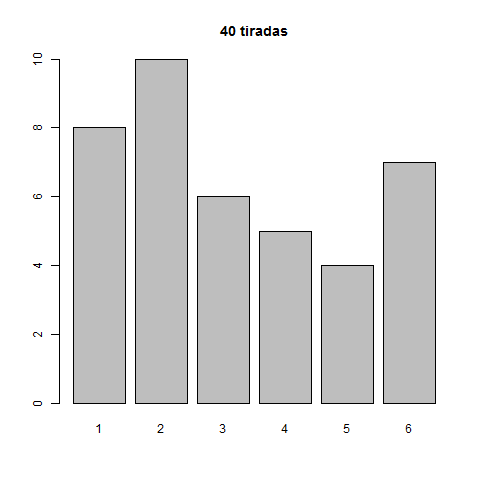
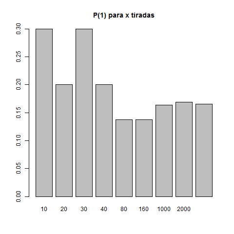
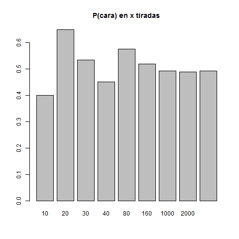
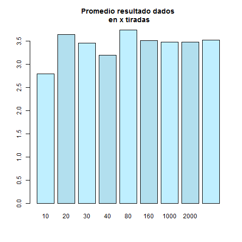
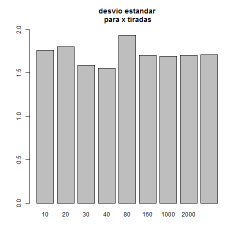
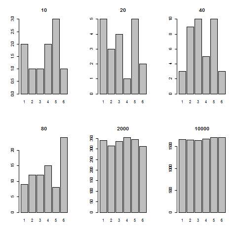

## Unidad 3
# Apunte sobre test Basico

``` R
> ## Test Basico
> # Ejercicio 1.2.1
> sample(1:6,20,replace=TRUE,prob=c(1/6,1/6,1/6,1/6,1/6,1/6))
 [1] 6 3 2 3 4 4 1 3 1 4 4 2 6 2 5 1 4 4 6 1
> x <- sample(1:6,40,replace=TRUE,prob=c(1/6,1/6,1/6,1/6,1/6,1/6))
> x
 [1] 5 2 3 5 3 2 6 3 3 6 1 2 6 6 3 2 5 6 5 3 4 4 1 2 6 2 1 6 1 2 2 1 2 1 4 1 4 2
[39] 4 1
> tx <- table(x)
> tx
x
 1  2  3  4  5  6 
 8 10  6  5  4  7 
> plot(table(x),type="h")
> barplot(tx, main="40 tiradas")
```


``` R
> p <- function(x){x/tx[x]}
> p(5)
   5 
1.25 
> p1 <- function(k){
+   x <- sample(1:6,k,replace=TRUE,prob=c(1/6,1/6,1/6,1/6,1/6,1/6))
+   tx <- table(x)
+   tx[1]/k
+ }
> p1(30)
        1 
0.1333333 
> res <- vapply(list(10,20,30,40,80,160,1000,2000,10000),p1,c(1))
> names(res) <- c(10,20,30,40,80,160,1000,2000,10000)
> plot(res,type="h")
> barplot(res, main="P(1) para x tiradas")  
```


``` R
> # Ejercicio 1.2.2
> sample(c(0,1),20,replace=TRUE,prob=c(0.5,0.5))
 [1] 0 0 0 1 0 1 1 1 1 0 1 0 1 1 1 0 0 1 1 1
> k <- 100
> moneda_p1 <- function(k){
+   x <- sample(c(0,1),k,replace=TRUE,prob=c(0.5,0.5))
+   tx <- table(x)
+   tx[1]/k
+ }
> moneda_p1(30)
        0 
0.5333333 
> res <- vapply(list(10,20,30,40,80,160,1000,2000,10000),moneda_p1,c(1))
> names(res) <- c(10,20,30,40,80,160,1000,2000,10000)
> plot(res,type="h")
> barplot(res, main="P(cara) en x tiradas")
```


``` R
> ## Promedio
> # Ejercicio 1.2.3
> k <- 100
> x <- sample(1:6,k,replace=TRUE,prob=c(1/6,1/6,1/6,1/6,1/6,1/6))
> x
  [1] 3 3 1 2 4 5 2 6 4 2 5 5 1 1 6 4 3 4 2 5 4 1 1 5 6 2 4 1 4 5 5 6 6 3 4 1 4
 [38] 4 2 1 5 4 1 3 3 1 2 2 6 4 5 5 4 5 6 6 3 1 5 2 6 6 2 1 5 6 1 5 6 5 3 1 4 2
 [75] 4 1 3 2 4 1 2 4 4 5 1 4 3 4 1 4 3 2 3 2 4 1 4 5 2 3
> sum(x)
[1] 339
> length(x)
[1] 100
> mean(x)
[1] 3.39
> promedio <- function(k){
+   x <- sample(1:6,k,replace=TRUE,prob=c(1/6,1/6,1/6,1/6,1/6,1/6))
+   mean(x)
+ }
> promedio (10)
[1] 3.5
> promedios <- vapply(list(10,20,30,40,80,160,1000,2000,10000),promedio,c(1))
> names(promedios) <- c(10,20,30,40,80,160,1000,2000,10000)
> promedios
      10       20       30       40       80      160     1000     2000 
2.800000 3.650000 3.466667 3.200000 3.750000 3.518750 3.488000 3.483000 
   10000 
3.527000 
> barplot(promedios, col=c("lightblue1","lightblue2"), main="Promedio resultado dados\n en x tiradas")
```


``` R
> # Ejercicio 1.2.6
> ?sd
> k <- 100
> x <- sample(1:6,k,replace=TRUE,prob=c(1/6,1/6,1/6,1/6,1/6,1/6))
> x
  [1] 6 6 6 4 6 2 1 4 1 1 6 3 3 1 6 6 3 6 6 2 1 5 1 6 5 1 3 4 3 2 3 4 1 5 6 6 3
 [38] 2 1 6 6 5 5 2 3 2 3 5 4 4 5 1 4 5 4 2 3 6 6 5 2 1 1 1 6 5 1 3 6 2 4 5 2 5
 [75] 3 1 3 2 3 6 2 2 6 3 6 4 3 5 6 3 5 5 4 2 1 4 1 2 3 5
> sum(x)
[1] 361
> length(x)
[1] 100
> mean(x)
[1] 3.61
> sd(x)
[1] 1.797276
> desviostd <- function(k){
+   x <- sample(1:6,k,replace=TRUE,prob=c(1/6,1/6,1/6,1/6,1/6,1/6))
+   sd(x)
+ }
> desvios <- vapply(list(10,20,30,40,80,160,1000,2000,10000),desviostd,c(1))
> names(desvios) <- c(10,20,30,40,80,160,1000,2000,10000)
> desvios
      10       20       30       40       80      160     1000     2000 
1.763834 1.803505 1.586219 1.552294 1.935307 1.706398 1.690797 1.701453 
   10000 
1.709289 
> barplot(desvios, ylim=c(0,2), main="desvio estandar\n para x tiradas")
```


``` R
> # Ejercicio 1.2.7
> k <- 10
> x <- sample(1:6,k,replace=TRUE,prob=c(1/6,1/6,1/6,1/6,1/6,1/6))
> tx <- table(x)
> barplot(tx)
> enetiradas <- function(n){
+   x <- sample(1:6,n,replace=TRUE,prob=c(1/6,1/6,1/6,1/6,1/6,1/6))
+   table(x)
+ }
> par(mfrow=c(2,3))
> barplot(enetiradas(10), main="10")
> barplot(enetiradas(20), main="20")
> barplot(enetiradas(40), main="40")
> barplot(enetiradas(80), main="80")
> barplot(enetiradas(2000), main="2000")
> barplot(enetiradas(10000), main="10000")
> par(mfrow=c(1,1))
> 
```


En lugar del ejemplo del transito tomo datos de iris
``` R
> # ajusto Petal.Length para la Specie Setosa con dnorm
> # le paso a dnorm los parametros mean y sd de los datos
> mean(iris[iris$Species=="setosa","Petal.Length"])
[1] 1.462
> sd(iris[iris$Species=="setosa","Petal.Length"])
[1] 0.173664
> # dnorm(x, mean=1.462, sd=0.173664)
> par(mfrow=c(2,1))
> hist(iris[iris$Species=="setosa",]$Petal.Length,breaks=seq(0.5,2.5,0.05), main="setosa Petal.Length\n mean=1.462 sd=0.173664")
> plot(function(x) dnorm(x, mean=1.462, sd=0.173664), 0.5, 2.5, main = "dnorm(x, mean=1.462, sd=0.173664)",ylab="")
> par(mfrow=c(1,1))
>
```


