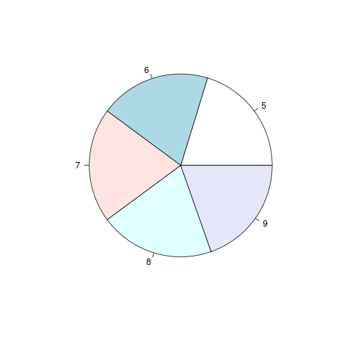

# Graficos y Sistemas de Graficos
``` R
> ?graphics
> library(help="graphics")
> library(help="grDevices")
> library(datasets)
> data(cars)
> head(cars)
  speed dist
1     4    2
2     4   10
3     7    4
4     7   22
5     8   16
6     9   10
> names(cars)
[1] "speed" "dist" 
> with(cars, plot(speed, dist, 
+                 xlab="Velocidad", ylab="Distancia", main="D vs V", 
+                 col.main="red", col="blue"  ))
> library(help="lattice")
```


``` R
> # https://www.datanalytics.com/2013/11/29/oscar-perpinan-sobre-graficos-base-vs-lattice-vs-ggplot2/
> library(help="ggplot2")
```

## grafico de lineas o line plot
``` R
> library(datasets)
> plot(airquality$Temp, ylim=c(50,100), type = "l")
```


## diagrama de dispersion o scaterplot con titulo
``` R
> with(airquality, plot(Wind, Ozone))
> title(main="Ozone and Wind inNew York City")
```


## diagrama de dispersion o scaterplot con titulo y colores en una seleccion
``` R
> with(airquality, plot(Wind, Ozone, main="Ozone and Wind inNew York City"))
> with(subset(airquality, Month == 5), points(Wind, Ozone, col="blue"))
```


## diagrama de dispersion o scaterplot con titulo y colores y legend
``` R
> with(airquality, plot(Wind, Ozone, main="Ozone and Wind inNew York City"))
> with(subset(airquality, Month == 5), points(Wind, Ozone, col="blue"))
> with(subset(airquality, Month != 5), points(Wind, Ozone, col="red"))
> legend("topright", pch = 1, col = c("blue","red"), legend = c("May","Other Months"))
```


## incluimos una linea de regresion
``` R
> with(airquality, plot(Wind, Ozone, main="Ozone and Wind inNew York City", pch=20)) # caracter que se muestra
> model <- lm(Ozone ~ Wind, airquality)
> abline(model, lwd=2) # line width
```


## graficos multiples
``` R
> par(mfrow = c(1, 2))
> with(airquality, {
+   plot(Wind, Ozone, main="Ozone and Wind")
+   plot(Solar.R, Ozone, main="Ozone and Solar Radiation")
+ })
> par(mfrow = c(1, 1))
```


## Grafico para visualizar correlaciones
``` R
> pairs(data.frame(airquality$Ozone, airquality$Solar.R, airquality$Wind, airquality$Temp))
```


## Histograma
``` R
> hist(airquality$Ozone)
```


## Diagrama de cajas o box plot
``` R
> airquality2 <- transform(airquality, Month = factor(Month))
> boxplot(Ozone ~ Month , airquality2, xlab = "Month", ylab = "Ozone (ppb)")
> boxplot(Ozone ~ Month , airquality, xlab = "Month", ylab = "Ozone (ppb)")
```


## Graficos de barras o bar chars
``` R
> # si es un factor, plot por defecto hace un grafico de barras
> plot(airquality$Month)
> plot(airquality2$Month)
```


## grafico de torta o pie
``` R
> # aca tambien influye si es faactor
> # sale mal x q no es factor
> pie(summary(airquality$Month))
> # sale bien
> pie(summary(airquality2$Month))
> summary(airquality$Month)
   Min. 1st Qu.  Median    Mean 3rd Qu.    Max. 
  5.000   6.000   7.000   6.993   8.000   9.000 
> summary(airquality2$Month)
 5  6  7  8  9 
31 30 31 31 30 
> # asi se hace si no es factor
> pie(table(airquality$Month))
```


## mapa de calor o heatmap
``` R
> set.seed(1234)
> par(mar = c(0,0,0,0))
> x <- rnorm(12, mean = rep(1:3, each = 4), sd = 0.2)
> y <- rnorm(12, mean = rep(c(1,2,1), each = 4), sd = 0.2)
> dataFrame <- data.frame(x = x, y = y)
> set.seed(143)
> dataMatrix <- as.matrix(dataFrame)[sample(1:12),]
> heatmap(dataMatrix)
```


## ejemplo
``` R
> # tenemos en 12 filas (meses), las ventas de 15 sucursales 
> meses <- seq(1,12)
> suc <- seq(1,15)
> # matris 12 x 15 con los numeros de ventas
> A <- matrix(sample(1:30, 12*15, replace = TRUE), nrow = 12, ncol = 15)
> heatmap(A, Rowv = NA, Colv = NA)
> colnames(A) <- suc
> rownames(A) <- meses
> A
    1  2  3  4  5  6  7  8  9 10 11 12 13 14 15
1  29  8 29  4  3 29  8 29  4  6 27  9 30 19 12
2  10 29 30 20  3 24 17 18 22 20 19 28  2 13 10
3  27 30 12 30 24 10 18 23 12 17 17  2 15  5 17
4  28 19  4  6 28  8 12  5  3  8 29 12  1 16 12
5  10 10  9  4 13 29  2 30 19 23 13 18  4 15 28
6   9 20  5 21 17 21 28 26 10 10 28 14 18 28  5
7  21  4  3 26 13 18 21 28 15 18 14 26 10  5 16
8   7  6 17 24  8 22 18 10 11  8  6  8 25  4 27
9  25  1 22 29 23 13 22  1 19 18 15 10 25 27 26
10  8  6  8  8  5 25  9 14  4 12 29  3  6  8 16
11 27 25 18 29 13  5 18  9  6 26 24 27 26 15 26
12 26 29 29 26  4 16 28 25 11 20 20 24  2 19 29
> heatmap(A, Rowv = NA, Colv = NA)
```


## Grafico QQ de probabilidad normal
``` R
> qqnorm(airquality$Wind)
> qqline(airquality$Wind)
Error in int_abline(a = a, b = b, h = h, v = v, untf = untf, ...) : 
  plot.new has not been called yet
```


## Exportando graficos
``` R
> # setear el directorio de trabajo al del script
> # despues lo paso a una carpeta no versionada
> setwd ("../descargas/unidad04/")
> pdf(file = "ejemplo_heatmap.pdf") # Creamos archivo y abrimos device
> heatmap(A, Rowv = NA, Colv = NA)
> dev.off()  # cerramos device
null device 
          1 
> setwd ("../descargas/unidad04/")
Error in eval(expr, envir, enclos) : 
  no es posible cambiar el directorio de trabajo
> png(file = "ejemplo_heatmap.png") # Creamos archivo y abrimos device
> heatmap(A, Rowv = NA, Colv = NA)
> dev.off()  # cerramos device
null device 
          1 
> 
```

# Clase interactiva

# Base, Lattice, Ggplot

# Graficos unidimencionales

## graficos de lineas
``` R
x <- c(1:100)
y <- c(sin(x/10))
plot(x,y)

x <- c(1:100)
y <- c(sin(x/10))
plot(x,y)
lines(y)
```

## histogramas
``` R
x <- rnorm(10000,3,1)
y <- rnorm(5000,7,1)
z <- rbind(x,y)
hist(z,100)
```

## graficos de barras
``` R
x <- c(1:10)
barplot(x)
```

# Graficos bidimencionales

## graficos de multiples lineas
``` R
x <- c(1:100)
y <- c(sin(x/10))
z <- c(sin(x/5))
png(file = "./graficos/multilineas_colores.png") # Creamos archivo y abrimos device
plot(x,y,type='l', col="red")
lines(y*0.75, col="green")
lines(z, col="blue")
dev.off()  # cerramos device
```


``` R
x <- rnorm(10000,3,1)
x2 <- rnorm(10000,20,1)
x3 <- rbind(x,x2)
y <- rnorm(10000,9,3)  # para que de igual que en el apunte sd = 3
y2 <- rbind(y,2*y)
range(y2)
range(x3)
plot(x3,y2)

hist(x3,50)
hist(y2,50)
```

## Grafico de burbujas
``` R
x=c(2,4,7,12,15)
y=c(12,10,15,25,23)
tamanio=c(100,120,230,340,800)
etiqueta=c("uno","dos","tres","cuatro")
palette(heat.colors(5))
symbols(x,y,circle=tamanio, bg=1:length(tamanio), fg="white")
text(x,y,etiqueta)
palette("default")
```

# Graficos tridimensionales
## 3D Scatterplot
``` R
install.packages("scatterplot3d")
library(scatterplot3d)
attach(mtcars)
names(mtcars)
# [1] "mpg"  "cyl"  "disp" "hp"   "drat" "wt"   "qsec" "vs"   "am"   "gear"
#[11] "carb"
scatterplot3d(wt,disp,mpg, main="3D Scatterplot")
```
