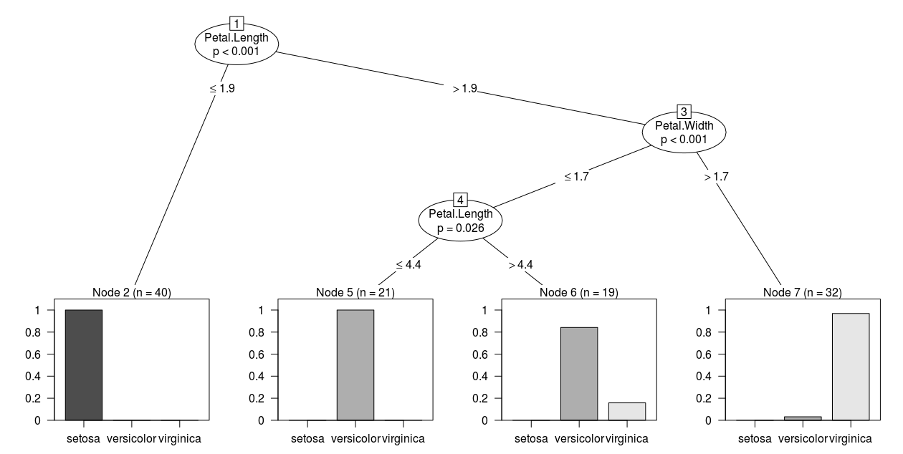
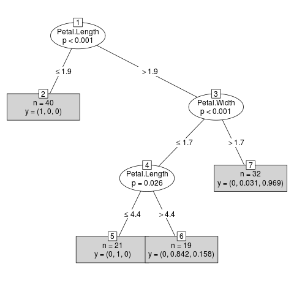

# Data Mining

## Decisions tree y random forest
**Arboles de decision:** mecanismo para detectar patrones y ganar conocimiento

**Reduccion de cantidad de atributos:** quedarnos con un conjunto de atributos *no correlacionados*

**Seleccion de muestras:** 2/3 *training* - 1/3 *testing*

**Algoritmos de creacion de arboles:** Cada divicion es un *nodo*, si no tiene division *hoja*.
Para cada atributo no utilizado busco el que mejor divide, asi hasta que no quedan atributos o ninguno divide bien.
Los algoritmos más difundidos son *CART*, *Ganancia de Entropía*, *C4.5* y *DKM*

**Podas:** Probando con el set de *testing*, eliminar las diviciones que no cumplan algun estandar de calidad. Estas incurren en *Sobre Ajuste*, ie. se fijan en casos particulares de la muestra pero irrelevantes en el universo.

* Prepoda: durante la construccion si ya veo que el nodo no conduce a nada.

* Postpoda: se divide hasta el final, y se elimina los que no alcanzan la calidad.

**Re-estructuracion:** A medida que se agregan casos, puede ser necesario modificar los nodos.

**Random Forest:** Generar arboles al azar, dentro de un rango, y probar cual es mejor.

## Decision tree con el paquete party

La función **ctree()** construye el arbol de decisiones, mientras que la función **predict()** hace las predicciones para nuevos datos.

``` R
> # seleccion de muestras
> setwd ("/home/tuxtin/Desa/DataScientistR/unidad05_datamining")
> set.seed(1234)
> ind <- sample(2, nrow(iris), replace = TRUE, prob=c(0.7, 0.3))
> trainData <- iris[ind==1,]
> testData <- iris[ind==2,]
> 
```

``` R
> # construir el arbol
> # install.packages("party")
> library(party)
Loading required package: grid
Loading required package: mvtnorm
Loading required package: modeltools
Loading required package: stats4
Loading required package: strucchange
Loading required package: zoo

Attaching package: ‘zoo’

The following objects are masked from ‘package:base’:

    as.Date, as.Date.numeric

Loading required package: sandwich
> myFormula <- Species ~ Sepal.Length + Sepal.Width + Petal.Length +  Petal.Width
> iris_ctree <- ctree(myFormula, data = trainData)
> 
```

El modelo generado a partir del comando **ctree()** lo hemos guardado en una variable llamada *'iris_ctree'*.

``` R
> # obtener las predicciones
> table(predict(iris_ctree), trainData$Species)
            
             setosa versicolor virginica
  setosa         40          0         0
  versicolor      0         37         3
  virginica       0          1        31
> 
```

``` R
> # ver las predicciones en detalle
> predict(iris_ctree)
  [1] setosa     setosa     setosa     setosa     setosa     setosa
  [7] setosa     setosa     setosa     setosa     setosa     setosa
  ...
 [91] virginica  virginica  virginica  virginica  virginica  virginica 
 [97] virginica  virginica  versicolor virginica  virginica  versicolor
[103] virginica  virginica  virginica  virginica  virginica  virginica 
[109] virginica  virginica  virginica  virginica 
Levels: setosa versicolor virginica
```

``` R
> # ver las reglas para el arbol construido
> print(iris_ctree)

	 Conditional inference tree with 4 terminal nodes

Response:  Species 
Inputs:  Sepal.Length, Sepal.Width, Petal.Length, Petal.Width 
Number of observations:  112 

1) Petal.Length <= 1.9; criterion = 1, statistic = 104.643
  2)*  weights = 40 
1) Petal.Length > 1.9
  3) Petal.Width <= 1.7; criterion = 1, statistic = 48.939
    4) Petal.Length <= 4.4; criterion = 0.974, statistic = 7.397
      5)*  weights = 21 
    4) Petal.Length > 4.4
      6)*  weights = 19 
  3) Petal.Width > 1.7
    7)*  weights = 32 
> 
```

``` R
> # graficar el arbol
> plot(iris_ctree)
```


``` R
> # graficar el arbol menos detalles
> plot(iris_ctree, type='simple')
> 
```


Los y = (p1, p2, p3) indican p1: P(Setosa), p2: P(Versicolor), p3: P(Virginia)

El número 'p' que aparece debajo de cada variable indica el valor de significación estadística de la división

Verificar la bondad del modelo usando los datos del *subconjunto de validación* ('testData'), para lo cual usamos el comando **predict()** pero ahora aplicado al *conjunto de validación*.

``` R
> # predict on test data
> testPred <- predict(iris_ctree, newdata = testData)
> table(testPred, testData$Species)
            
testPred     setosa versicolor virginica
  setosa         10          0         0
  versicolor      0         12         2
  virginica       0          0        14
> 
```

Solo dos elementos fuera de la diagonal. Muy bueno.

## Decision tree con el paquete rpart

La funcion **rpart()** construye el arbol. El paquete *rpart* evalua automaticamente varios arboles.

``` R
> # seleccion de muestras
> data("bodyfat", package = "TH.data")
> ind <- sample(2, nrow(bodyfat), replace = TRUE, prob= c(0.7, 0.3))
> bodyfat.train <- bodyfat[ind==1,]
> bodyfat.test <- bodyfat[ind==2,]
> 
```

Notemos que nuestra variable objetivo es *'DEXfat'*, y que las variables predictoras son *'age', 'waistcirc', 'hipcirc', 'elbowbreadth', 'kneebreadth'*:
``` R
> # construir el arbol
> library(rpart)
> myFormula <- DEXfat ~ age + waistcirc + hipcirc + elbowbreadth + kneebreadth
> bodyfat_rpart <- rpart(myFormula, data = bodyfat.train, control = rpart.control(minsplit = 10))
```

``` R
> attributes(bodyfat_rpart)
$names
 [1] "frame"               "where"               "call"
 [4] "terms"               "cptable"             "method"
 [7] "parms"               "control"             "functions"
[10] "numresp"             "splits"              "variable.importance"
[13] "y"                   "ordered"

$xlevels
named list()

$class
[1] "rpart"
```

La variable *'cptable'* dentro del modelo contiene la evolución del error del árbol de decisión a medida que se agregan divisiones (automáticamente):
``` R
> print(bodyfat_rpart$cptable)
          CP nsplit  rel error    xerror      xstd
          CP nsplit  rel error    xerror       xstd
1 0.70184988      0 1.00000000 1.0362533 0.20711021
2 0.08495554      1 0.29815012 0.3710943 0.10083249
3 0.05234206      2 0.21319459 0.3616000 0.09585713
4 0.02577515      3 0.16085253 0.3456613 0.09015238
5 0.01995049      4 0.13507738 0.3145581 0.07391517
6 0.01857568      5 0.11512689 0.2925126 0.07452136
7 0.01000000      6 0.09655122 0.2841753 0.07589455
> 
```

``` R
> # el minimo xerror
> opt <- which.min(bodyfat_rpart$cptable[,"xerror"])
> opt
7 
7 
```

``` R
> # el CP correspondiente
> cp <- bodyfat_rpart$cptable[opt, "CP"]
> cp
[1] 0.01
> 
```

``` R
> # podamos aplicando prune() al arbol del modelo original (bodyfat_rpart) con CP = cp
> bodyfat_prune <- prune(bodyfat_rpart, cp = cp)
> print(bodyfat_prune)
n= 47 

node), split, n, deviance, yval
      * denotes terminal node

 1) root 47 5315.88100 30.00128 
   2) hipcirc< 108 30  881.31110 23.29433 
     4) hipcirc< 98 16  217.85240 19.66500 
       8) age< 55.5 7   61.33357 16.74571 *
       9) age>=55.5 9   50.46442 21.93556 *
     5) hipcirc>=98 14  211.84520 27.44214 
      10) waistcirc< 76.5 3   11.81447 22.35667 *
      11) waistcirc>=76.5 11  101.28470 28.82909 *
   3) hipcirc>=108 17  703.61940 41.83706 
     6) waistcirc< 106 14  219.83390 39.96429 
      12) hipcirc< 116.4 8   67.67580 37.25500 *
      13) hipcirc>=116.4 6   15.14053 43.57667 *
     7) waistcirc>=106 3  205.54130 50.57667 *
> 
```

Una vez que elegimos el árbol que menor error da, y lo podamos, lo podemos usar para realizar una predicción:

```R
> DEXfat_pred <- predict(bodyfat_prune, newdata=bodyfat.test)
> xlim <- range(bodyfat$DEXfat)
> xlim
[1] 11.21 62.02
> plot(DEXfat_pred ~ DEXfat, data=bodyfat.test, xlab="Observed", ylab="Predicted", ylim=xlim, xlim=xlim)
> abline(a=0, b=1)
> 
```


