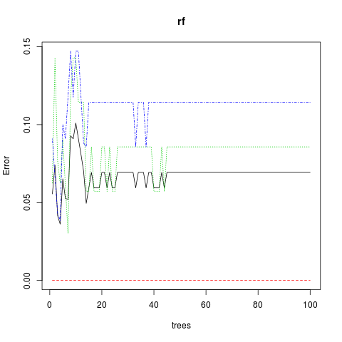
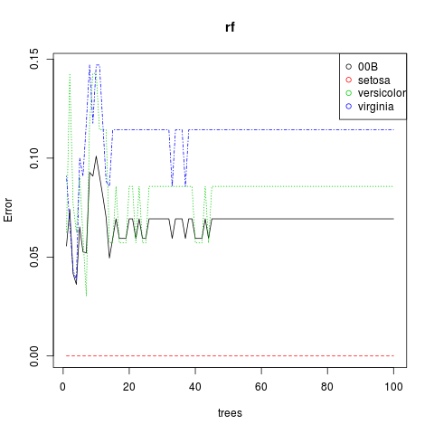
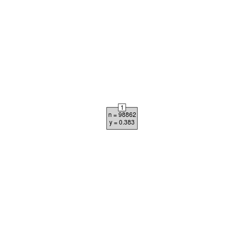
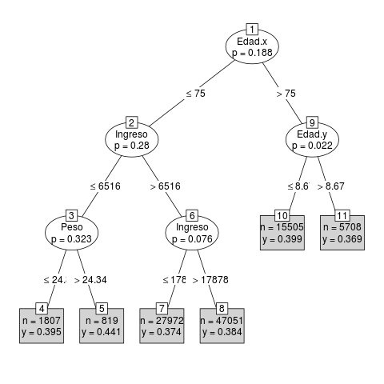

# Data Mining

## Decisions tree y random forest
**Arboles de decision:** mecanismo para detectar patrones y ganar conocimiento

**Reduccion de cantidad de atributos:** quedarnos con un conjunto de atributos *no correlacionados*

**Seleccion de muestras:** 2/3 *training* - 1/3 *testing*

**Algoritmos de creacion de arboles:** Cada divicion es un *nodo*, si no tiene division *hoja*.
Para cada atributo no utilizado busco el que mejor divide, asi hasta que no quedan atributos o ninguno divide bien.
Los algoritmos más difundidos son *CART*, *Ganancia de Entropía*, *C4.5* y *DKM*

**Podas:** Probando con el set de *testing*, eliminar las diviciones que no cumplan algun estandar de calidad. Estas incurren en **Sobre Ajuste**, ie. se fijan en casos particulares de la muestra pero irrelevantes en el universo.

* Prepoda: durante la construccion si ya veo que el nodo no conduce a nada.

* Postpoda: se divide hasta el final, y se elimina los que no alcanzan la calidad.

**Re-estructuracion:** A medida que se agregan casos, puede ser necesario modificar los nodos.

**Random Forest:** Generar arboles al azar, dentro de un rango, y probar cual es mejor.

## Decision tree con el paquete party

La función **ctree()** construye el arbol de decisiones, mientras que la función **predict()** hace las predicciones para nuevos datos.

``` R
> # seleccion de muestras
> setwd ("~/Desa/DataScientistR/unidad05_datamining")
> set.seed(1234)
> ind <- sample(2, nrow(iris), replace = TRUE, prob=c(0.7, 0.3))
> trainData <- iris[ind==1,]
> testData <- iris[ind==2,]
> 
```

``` R
> # construir el arbol
> # install.packages("party")
> library(party)
Loading required package: grid
Loading required package: mvtnorm
Loading required package: modeltools
Loading required package: stats4
Loading required package: strucchange
Loading required package: zoo

Attaching package: ‘zoo’

The following objects are masked from ‘package:base’:

    as.Date, as.Date.numeric

Loading required package: sandwich
> # obtener las predicciones
> myFormula <- Species ~ Sepal.Length + Sepal.Width + Petal.Length +  Petal.Width
> iris_ctree <- ctree(myFormula, data = trainData)
> 
```

El modelo generado a partir del comando **ctree()** lo hemos guardado en una variable llamada *'iris_ctree'*.

``` R
> # comparar con set de training
> table(predict(iris_ctree), trainData$Species)
            
             setosa versicolor virginica
  setosa         40          0         0
  versicolor      0         37         3
  virginica       0          1        31
> 
```

``` R
> # ver las predicciones en detalle
> predict(iris_ctree)
  [1] setosa     setosa     setosa     setosa     setosa     setosa
  [7] setosa     setosa     setosa     setosa     setosa     setosa
  ...
 [91] virginica  virginica  virginica  virginica  virginica  virginica 
 [97] virginica  virginica  versicolor virginica  virginica  versicolor
[103] virginica  virginica  virginica  virginica  virginica  virginica 
[109] virginica  virginica  virginica  virginica 
Levels: setosa versicolor virginica
```

``` R
> # ver las reglas para el arbol construido
> print(iris_ctree)

	 Conditional inference tree with 4 terminal nodes

Response:  Species 
Inputs:  Sepal.Length, Sepal.Width, Petal.Length, Petal.Width 
Number of observations:  112 

1) Petal.Length <= 1.9; criterion = 1, statistic = 104.643
  2)*  weights = 40 
1) Petal.Length > 1.9
  3) Petal.Width <= 1.7; criterion = 1, statistic = 48.939
    4) Petal.Length <= 4.4; criterion = 0.974, statistic = 7.397
      5)*  weights = 21 
    4) Petal.Length > 4.4
      6)*  weights = 19 
  3) Petal.Width > 1.7
    7)*  weights = 32 
> 
```

``` R
> # graficar el arbol
> plot(iris_ctree)
```


``` R
> # graficar el arbol menos detalles
> plot(iris_ctree, type='simple')
> 
```


Los y = (p1, p2, p3) indican p1: P(Setosa), p2: P(Versicolor), p3: P(Virginia)

El número 'p' que aparece debajo de cada variable indica el valor de significación estadística de la división

Verificar la bondad del modelo usando los datos del *subconjunto de validación* ('testData'), para lo cual usamos el comando **predict()** pero ahora aplicado al *conjunto de validación*.

``` R
> # predict on test data
> testPred <- predict(iris_ctree, newdata = testData)
> table(testPred, testData$Species)
            
testPred     setosa versicolor virginica
  setosa         10          0         0
  versicolor      0         12         2
  virginica       0          0        14
> 
```

Solo dos elementos fuera de la diagonal. Muy bueno.

## Decision tree con el paquete rpart

La funcion **rpart()** construye el arbol. El paquete *rpart* evalua automaticamente varios arboles.

``` R
> # seleccion de muestras
> data("bodyfat", package = "TH.data")
> ind <- sample(2, nrow(bodyfat), replace = TRUE, prob= c(0.7, 0.3))
> bodyfat.train <- bodyfat[ind==1,]
> bodyfat.test <- bodyfat[ind==2,]
> 
```

Notemos que nuestra variable objetivo es *'DEXfat'*, y que las variables predictoras son *'age', 'waistcirc', 'hipcirc', 'elbowbreadth', 'kneebreadth'*:
``` R
> # construir el arbol
> library(rpart)
> myFormula <- DEXfat ~ age + waistcirc + hipcirc + elbowbreadth + kneebreadth
> bodyfat_rpart <- rpart(myFormula, data = bodyfat.train, control = rpart.control(minsplit = 10))
```

``` R
> attributes(bodyfat_rpart)
$names
 [1] "frame"               "where"               "call"
 [4] "terms"               "cptable"             "method"
 [7] "parms"               "control"             "functions"
[10] "numresp"             "splits"              "variable.importance"
[13] "y"                   "ordered"

$xlevels
named list()

$class
[1] "rpart"
```

La variable *'cptable'* dentro del modelo contiene la evolución del error del árbol de decisión a medida que se agregan divisiones (automáticamente):
``` R
> print(bodyfat_rpart$cptable)
          CP nsplit  rel error    xerror      xstd
          CP nsplit  rel error    xerror       xstd
1 0.70184988      0 1.00000000 1.0362533 0.20711021
2 0.08495554      1 0.29815012 0.3710943 0.10083249
3 0.05234206      2 0.21319459 0.3616000 0.09585713
4 0.02577515      3 0.16085253 0.3456613 0.09015238
5 0.01995049      4 0.13507738 0.3145581 0.07391517
6 0.01857568      5 0.11512689 0.2925126 0.07452136
7 0.01000000      6 0.09655122 0.2841753 0.07589455
> 
```

``` R
> # el minimo xerror
> opt <- which.min(bodyfat_rpart$cptable[,"xerror"])
> opt
7 
7 
```

``` R
> # el CP correspondiente
> cp <- bodyfat_rpart$cptable[opt, "CP"]
> cp
[1] 0.01
> 
```

``` R
> # podamos aplicando prune() al arbol del modelo original (bodyfat_rpart) con CP = cp
> bodyfat_prune <- prune(bodyfat_rpart, cp = cp)
> print(bodyfat_prune)
n= 47 

node), split, n, deviance, yval
      * denotes terminal node

 1) root 47 5315.88100 30.00128 
   2) hipcirc< 108 30  881.31110 23.29433 
     4) hipcirc< 98 16  217.85240 19.66500 
       8) age< 55.5 7   61.33357 16.74571 *
       9) age>=55.5 9   50.46442 21.93556 *
     5) hipcirc>=98 14  211.84520 27.44214 
      10) waistcirc< 76.5 3   11.81447 22.35667 *
      11) waistcirc>=76.5 11  101.28470 28.82909 *
   3) hipcirc>=108 17  703.61940 41.83706 
     6) waistcirc< 106 14  219.83390 39.96429 
      12) hipcirc< 116.4 8   67.67580 37.25500 *
      13) hipcirc>=116.4 6   15.14053 43.57667 *
     7) waistcirc>=106 3  205.54130 50.57667 *
> 
```

Una vez que elegimos el árbol que menor error da, y lo podamos, lo podemos usar para realizar una predicción:

``` R
> DEXfat_pred <- predict(bodyfat_prune, newdata=bodyfat.test)
> xlim <- range(bodyfat$DEXfat)
> xlim
[1] 11.21 62.02
> plot(DEXfat_pred ~ DEXfat, data=bodyfat.test, xlab="Observed", ylab="Predicted", ylim=xlim, xlim=xlim)
> abline(a=0, b=1)
> 
```


## Random Forest

Usaremos el paquete *randomForest*. Tiene dos limitaciones, no maneja *NAs*, y maximo de atributos categoricos = 32.
Una alternativa es **cforest()** de *party*.

``` R
> library(randomForest)
randomForest 4.6-12
Type rfNews() to see new features/changes/bug fixes.
> 
```

La fórmula esta construida para *Species '~ .'*, que significa predecir *'Species'* con todas las otras variables como predictoras:
``` R
> rf <- randomForest(Species ~ ., data=trainData, ntree=100, proximity=TRUE)
> table(predict(rf), trainData$Species)
            
             setosa versicolor virginica
  setosa         31          0         0
  versicolor      0         32         4
  virginica       0          3        31
> 
```

Para ver el error en la clasificación, podemos usar el comando **print()**

``` R
> print(rf)

Call:
 randomForest(formula = Species ~ ., data = trainData, ntree = 100,      proximity = TRUE) 
               Type of random forest: classification
                     Number of trees: 100
No. of variables tried at each split: 2

        OOB estimate of  error rate: 6.93%
Confusion matrix:
           setosa versicolor virginica class.error
setosa         31          0         0  0.00000000
versicolor      0         32         3  0.08571429
virginica       0          4        31  0.11428571
> 
```
En *Random Forests* estamos tratando con conjuntos de árboles de decisión. 
Por default, los comandos de *Random Forest* seleccionan aquel *modelo que minimiza el error*.
En su forma más simple, los modelos *difieren en el número de árboles* que contienen.

Grafiquemos el error del modelo (es decir, que tan mal predice) en función del número de árboles considerados en el conjunto:

``` R
> # graficar el error del modelo
> plot(rf)
```


``` R
> # el plot muestra la matrix rf$err.rate
> # lo mejoro
> matplot(rf$err.rate, type="l", ylab="Error", xlab="trees", main="rf")
> legend("topright", col=palette(), legend=c("00B","setosa","versicolor","virginia"), pch=1)
> 
```


Para determinar la importancia de las variables usamos dos funciones: **importance()** y **varImpPlot()**.

``` R
> importance(rf)
             MeanDecreaseGini
Sepal.Length         7.359034
Sepal.Width          1.926906
Petal.Length        25.090438
Petal.Width         32.084513
> 
```


Una vez que estamos satisfechos con el modelo creado, debemos validarlo sobre los datos de validación. 
Utilizamos la función **predict()**, usando el mismo modelo *('rf')* pero los datos de validación *('testData')*. 
Luego, podemos comparar la predicción con el valor real, que está en 'testData$Species':

``` R
> # prediccion y comparacion
> irisPred <- predict(rf, newdata=testData)
> table(irisPred, testData$Species)
            
irisPred     setosa versicolor virginica
  setosa         10          0         0
  versicolor      0         12         1
  virginica       0          0        15
> 
```

---
---
---

# Clase interactiva
## Árboles de decisión
Preparo los datos desde las tablas de Visitas, Duenos y Mascotas
``` R
> Navegacion <- read.csv2("../descargas/unidad03/Mascotas_2a/Navegacion_csv.txt")
> head(Navegacion)
  Id IdDueno IdPagina          DT Secuencia Venta Importe
1  1       1        4 0.230000000         1     0       0
2  2       2       19 2.810000000        19     0       0
3  3       2        1 1.030000000      1-19     0       0
4  4       1        1 5.030000000         1     0       0
5  5       2        6 5.640000000         6     0       0
6  6       2       12 0.004689429      12-6     0       0
> nrow(Navegacion)  # [1] 1.048.573
[1] 1048573
> range(Navegacion[["IdDueno"]])  # [1]    0 7999
[1]    0 7999
```
``` R
> Duenos <- read.csv2("../descargas/unidad03/Mascotas_2a/Duenos_csv.txt")
> head(Duenos)
  Id IdDueno Perros Gatos Total Edad Sexo Ingreso
1  5       1      1     2     3   60    M  116816
2  6       3      2    NA     2   76    M   16334
3  7       4      2    NA     2   43    F   34890
4  8       5     NA     1     1   36    M   38786
5  9       6      1    NA     1   63    F   22966
6 10       7      1    NA     1   74    F    8894
> nrow(Duenos)  # [1] 5.665
[1] 5665
> range(Duenos[["IdDueno"]])  # [1] NA NA
[1] NA NA
> Duenos[is.na(Duenos$IdDueno),]  # hay un registro con IdDueño en NA
       Id IdDueno Perros Gatos Total Edad Sexo Ingreso
5665 5669      NA   7133  2867 10000   NA           NA
```
``` R
> datos_cor_v_d <- merge(Navegacion, Duenos, by.x="IdDueno", by.y="IdDueno")
> head(datos_cor_v_d)
  IdDueno   Id.x IdPagina           DT Secuencia Venta Importe Id.y Perros
1       1  79676       18 0.0100000000     18-20     0       0    5      1
2       1 637155        1 0.1700000000         1     0       0    5      1
3       1 637156        5 2.0800000000       5-1     0       0    5      1
4       1 984294       11 2.7000000000     11-10     0       0    5      1
5       1 637158        3 0.0009041193    3-17-5     0       0    5      1
6       1 743844        4 3.0500000000     4-4-3     0       0    5      1
  Gatos Total Edad Sexo Ingreso
1     2     3   60    M  116816
2     2     3   60    M  116816
3     2     3   60    M  116816
4     2     3   60    M  116816
5     2     3   60    M  116816
6     2     3   60    M  116816
> nrow(datos_cor_v_d)  # [1] 741.887
[1] 741887
```
``` R
> datos_cor_v_d[is.na(datos_cor_v_d$IdDueno),]
 [1] IdDueno   Id.x      IdPagina  DT        Secuencia Venta     Importe
 [8] Id.y      Perros    Gatos     Total     Edad      Sexo      Ingreso
<0 rows> (or 0-length row.names)
> Mascotas <- read.csv2("../descargas/unidad03/Mascotas_2a/Mascotas_csv.txt")
> head(Mascotas)
  IdMascota IdDueno IdEspecie IdRaza  Peso  Edad Sexo
1         1    5627         1     89 11.81  0.01    M
2         2     398         1     40  7.78 12.64    M
3         3    1962         1     35  6.75  0.56    F
4         4    6113         2    170  6.40  7.07    F
5         5    1802         2    166  5.42  0.14    M
6         6    4092         1     36 18.82  0.29    M
```
``` R
> datos_cor_v_d_m <- merge(datos_cor_v_d, Mascotas, by.x="IdDueno", by.y="IdDueno")
> head(datos_cor_v_d_m)
  IdDueno   Id.x IdPagina   DT Secuencia Venta Importe Id.y Perros Gatos Total
1       1 663432       11 0.15     11-20     0    0.00    5      1     2     3
2       1 663432       11 0.15     11-20     0    0.00    5      1     2     3
3       1  26557       15 4.67     15-19     0    0.00    5      1     2     3
4       1  26557       15 4.67     15-19     0    0.00    5      1     2     3
5       1 877270        6 4.70    6-8-18     1   65.38    5      1     2     3
6       1 877270        6 4.70    6-8-18     1   65.38    5      1     2     3
  Edad.x Sexo.x Ingreso IdMascota IdEspecie IdRaza  Peso Edad.y Sexo.y
1     60      M  116816      9688         1     13 45.06   4.43      M
2     60      M  116816      5839         1     54 55.68   2.68      F
3     60      M  116816      9688         1     13 45.06   4.43      M
4     60      M  116816      5839         1     54 55.68   2.68      F
5     60      M  116816      9688         1     13 45.06   4.43      M
6     60      M  116816      5839         1     54 55.68   2.68      F
+ nrow(datos_cor_v_d_m)  # [1] 924.214
[1] 924214
```
## reduccio de cantidad de atributos
``` R
> names(datos_cor_v_d_m)
 [1] "IdDueno"   "Id.x"      "IdPagina"  "DT"        "Secuencia" "Venta"
 [7] "Importe"   "Id.y"      "Perros"    "Gatos"     "Total"     "Edad.x"
[13] "Sexo.x"    "Ingreso"   "IdMascota" "IdEspecie" "IdRaza"    "Peso"
[19] "Edad.y"    "Sexo.y" 
> datos_cor_v_d_m$Id.x <- NULL
> datos_cor_v_d_m$Id.y <- NULL
> datos_cor_v_d_m$IdDueno <- NULL
> datos_cor_v_d_m$IdPagina <- NULL
> datos_cor_v_d_m$Sexo.x <- NULL
> datos_cor_v_d_m$Sexo.y <- NULL
> datos_cor_v_d_m$Secuencia <- NULL
> cor_datos <- cor(datos_cor_v_d_m)
> print(cor_datos)
                     DT         Venta       Importe Perros Gatos        Total
DT         1.0000000000  0.3411513002  0.2113240521     NA    NA -0.001155177
Venta      0.3411513002  1.0000000000  0.6160266642     NA    NA -0.000821532
Importe    0.2113240521  0.6160266642  1.0000000000     NA    NA  0.001064513
Perros               NA            NA            NA      1    NA           NA
Gatos                NA            NA            NA     NA     1           NA
Total     -0.0011551770 -0.0008215320  0.0010645129     NA    NA  1.000000000
Edad.x     0.0008280293  0.0018561832  0.0036557726     NA    NA  0.153608727
Ingreso    0.0029322559 -0.0001163729  0.0004272961     NA    NA  0.030987792
IdMascota  0.0002941970 -0.0003527344  0.0001555873     NA    NA -0.001383685
IdEspecie -0.0008110911 -0.0003641878  0.0016217341     NA    NA -0.017965070
IdRaza     0.0000888130 -0.0002247527  0.0018594746     NA    NA -0.015894674
Peso       0.0007095934  0.0011938789 -0.0015255209     NA    NA -0.002733299
Edad.y     0.0016518463 -0.0004777844  0.0020018203     NA    NA  0.017726153
                 Edad.x       Ingreso     IdMascota     IdEspecie        IdRaza
DT         0.0008280293  0.0029322559  0.0002941970 -0.0008110911  0.0000888130
Venta      0.0018561832 -0.0001163729 -0.0003527344 -0.0003641878 -0.0002247527
Importe    0.0036557726  0.0004272961  0.0001555873  0.0016217341  0.0018594746
Perros               NA            NA            NA            NA            NA
Gatos                NA            NA            NA            NA            NA
Total      0.1536087271  0.0309877915 -0.0013836849 -0.0179650703 -0.0158946742
Edad.x     1.0000000000  0.0485650533  0.0045340171  0.0164402884  0.0141910798
Ingreso    0.0485650533  1.0000000000 -0.0381967370  0.0017210711  0.0090012570
IdMascota  0.0045340171 -0.0381967370  1.0000000000  0.0024625936 -0.0047707970
IdEspecie  0.0164402884  0.0017210711  0.0024625936  1.0000000000  0.8424823584
IdRaza     0.0141910798  0.0090012570 -0.0047707970  0.8424823584  1.0000000000
Peso       0.0005981312 -0.0014123738  0.0103360575 -0.4941149612 -0.4231110525
Edad.y    -0.0044916692 -0.0173274563  0.0211147820  0.0969521767  0.0877485710
                   Peso        Edad.y
DT         0.0007095934  0.0016518463
Venta      0.0011938789 -0.0004777844
Importe   -0.0015255209  0.0020018203
Perros               NA            NA
Gatos                NA            NA
Total     -0.0027332992  0.0177261528
Edad.x     0.0005981312 -0.0044916692
Ingreso   -0.0014123738 -0.0173274563
IdMascota  0.0103360575  0.0211147820
IdEspecie -0.4941149612  0.0969521767
IdRaza    -0.4231110525  0.0877485710
Peso       1.0000000000 -0.1814750837
Edad.y    -0.1814750837  1.0000000000
```

la idea es que si hay atributos coorelacionados, me quedo con uno solo de esos

sigo limpiando
``` R
> datos_cor_v_d_m$Perros <- NULL
> datos_cor_v_d_m$Gatos <- NULL
> datos_cor_v_d_m$IdMascota <- NULL
> datos_cor_v_d_m$IdEspecie <- NULL
> datos_cor_v_d_m$IdRaza <- NULL
> # datos_cor_v_d_m$Edad.y <- NULL
> names(datos_cor_v_d_m)
[1] "DT"      "Venta"   "Importe" "Total"   "Edad.x"  "Ingreso" "Peso"   
[8] "Edad.y" 
> head(datos_cor_v_d_m)
    DT Venta Importe Total Edad.x Ingreso  Peso Edad.y
1 0.15     0    0.00     3     60  116816 45.06   4.43
2 0.15     0    0.00     3     60  116816 55.68   2.68
3 4.67     0    0.00     3     60  116816 45.06   4.43
4 4.67     0    0.00     3     60  116816 55.68   2.68
5 4.70     1   65.38     3     60  116816 45.06   4.43
6 4.70     1   65.38     3     60  116816 55.68   2.68
```
``` R
> cor_datos <- cor(datos_cor_v_d_m)
> print(cor_datos)
                   DT         Venta       Importe        Total        Edad.x
DT       1.0000000000  0.3411513002  0.2113240521 -0.001155177  0.0008280293
Venta    0.3411513002  1.0000000000  0.6160266642 -0.000821532  0.0018561832
Importe  0.2113240521  0.6160266642  1.0000000000  0.001064513  0.0036557726
Total   -0.0011551770 -0.0008215320  0.0010645129  1.000000000  0.1536087271
Edad.x   0.0008280293  0.0018561832  0.0036557726  0.153608727  1.0000000000
Ingreso  0.0029322559 -0.0001163729  0.0004272961  0.030987792  0.0485650533
Peso     0.0007095934  0.0011938789 -0.0015255209 -0.002733299  0.0005981312
Edad.y   0.0016518463 -0.0004777844  0.0020018203  0.017726153 -0.0044916692
              Ingreso          Peso        Edad.y
DT       0.0029322559  0.0007095934  0.0016518463
Venta   -0.0001163729  0.0011938789 -0.0004777844
Importe  0.0004272961 -0.0015255209  0.0020018203
Total    0.0309877915 -0.0027332992  0.0177261528
Edad.x   0.0485650533  0.0005981312 -0.0044916692
Ingreso  1.0000000000 -0.0014123738 -0.0173274563
Peso    -0.0014123738  1.0000000000 -0.1814750837
Edad.y  -0.0173274563 -0.1814750837  1.0000000000
```
estos dos estan correlacionados con venta
``` R
> datos_cor_v_d_m$DT <- NULL
> datos_cor_v_d_m$Importe <- NULL
> datos_cor_v_d_m$Total <- NULL
```
## generacion de muestras
Creo los vectores de selección para si y no:
``` R
> xsi <- which(datos_cor_v_d_m$Venta==1)
> xno <- which(datos_cor_v_d_m$Venta==0)
> length(xsi)
[1] 54144
> # [1] 54144
> length(xno)
[1] 870070
> # [1] 870070
```

Selecciono separando ventas si y ventas no
``` R
> hsi<-datos_cor_v_d_m[xsi,]
> nrow(hsi)
[1] 54144
> # [1] 54144
> hno<-datos_cor_v_d_m[xno,]
> nrow(hno)
[1] 870070
> # [1] 870070
```
Me quedo con el 70% del si y el 7% del no

porque esta muy desbalanceado 50.000 vs 870.000
``` R
> xsi <- runif(nrow(hsi))
> xno <- runif(nrow(hno))
> xsi_train <- which(xsi<.7)
> xno_train <- which(xno<.07)
> hsi_train <- hsi[xsi_train,]
> hno_train <- hno[xno_train,]
> nrow(hsi_train)
[1] 37899
> # aprox [1] 38000
> nrow(hno_train)
[1] 60963
> # aprox [1] 60800
```

Junto los dos trozos de h_train y h_test
``` R
> h_train <- rbind(hsi_train,hno_train)
> nrow(h_train)
[1] 98862
> # aprox [1] 98545
> # armo el test
> xsi_test <- which(xsi>=.7)
> xno_test <- which(abs(xno-.1)<.03)
> hsi_test <- hsi[xsi_test,]
> hno_test <- hno[xno_test,]
> h_test <- rbind(hsi_test,hno_test)
> nrow(h_test)
[1] 68821
> # aprox [1] 68910
> 
```
todo listo para armar el arbol
## Paquete party
``` R
> library(party)
> names(h_train)
[1] "Venta"   "Edad.x"  "Ingreso" "Peso"    "Edad.y" 
> formula <- Venta ~ Edad.y + Edad.x + Ingreso + Peso
> train_tree <- ctree(formula, data = h_train)
> plot(train_tree, type="simple")
```



``` R
> # corrijo controls
> train_tree <- ctree(formula, data = h_train, controls = ctree_control(mincriterion = .6))
> plot(train_tree,type="simple")
> 
```


## Paquete rpart
``` R
> library(rpart)
> formula <- Venta ~ Edad.y + Edad.x + Ingreso + Peso
> train_tree <- rpart(formula, data = h_train)
> plot(train_tree)
Error in plot.rpart(train_tree) : fit is not a tree, just a root
```

corrijo parametro cp
``` R
> train_tree <- rpart(formula, data = h_train, cp=.000073)
> print(train_tree)
n= 98862 

node), split, n, deviance, yval
      * denotes terminal node

  1) root 98862 23370.32000 0.3833526  
    2) Ingreso>=5071.5 98509 23278.54000 0.3829904  
      4) Edad.y>=0.015 94864 22399.35000 0.3821892  
        8) Edad.y< 0.055 2641   605.42980 0.3559258 *
        9) Edad.y>=0.055 92223 21792.04000 0.3829413  
         18) Edad.x< 34.5 23982  5629.17100 0.3764073 *
         19) Edad.x>=34.5 68241 16161.49000 0.3852376  
           38) Peso>=8.855 31528  7433.34700 0.3807092  
             76) Peso< 9.135 564   122.91310 0.3209220  
              152) Ingreso< 16473 159    28.38994 0.2327044 *
              153) Ingreso>=16473 405    92.80000 0.3555556 *
             77) Peso>=9.135 30964  7308.38100 0.3817982 *
           39) Peso< 8.855 36713  8726.93900 0.3891265  
             78) Peso< 8.635 36352  8634.77900 0.3883418  
              156) Edad.x>=56.5 21868  5167.31100 0.3829340  
                312) Edad.y>=8.825 7038  1638.71500 0.3689969  
                  624) Edad.y< 10.305 1486   329.44080 0.3317631 *
                  625) Edad.y>=10.305 5552  1306.66300 0.3789625 *
                313) Edad.y< 8.825 14830  3526.58000 0.3895482  
                  626) Ingreso>=10406.5 12066  2854.75600 0.3842201 *
                  627) Ingreso< 10406.5 2764   669.98660 0.4128075 *
              157) Edad.x< 56.5 14484  3465.86300 0.3965065 *
             79) Peso>=8.635 361    89.88366 0.4681440 *
      5) Edad.y< 0.015 3645   877.54620 0.4038409  
       10) Ingreso>=6854.5 3528   846.47960 0.3996599 *
       11) Ingreso< 6854.5 117    29.14530 0.5299145 *
    3) Ingreso< 5071.5 353    88.16431 0.4844193 *
> plot(train_tree)
> 
```
``` R
> train_tree$cptable
            CP nsplit rel error   xerror        xstd
1 1.548388e-04      0 1.0000000 1.000023 0.001526113
2 7.760141e-05      1 0.9998452 1.000236 0.001532812
3 7.396755e-05      4 0.9996124 1.004371 0.001603036
4 7.373384e-05     12 0.9989712 1.004845 0.001611150
5 7.300000e-05     13 0.9988974 1.004924 0.001613620
> train_tree$variable.importance
 Ingreso   Edad.y     Peso   Edad.x 
9.407314 8.491681 5.713626 3.950673 
> 
```

