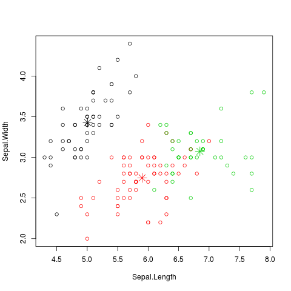
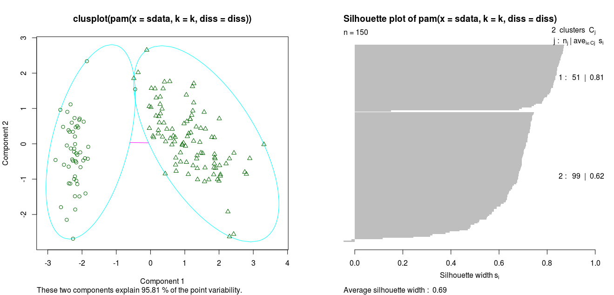
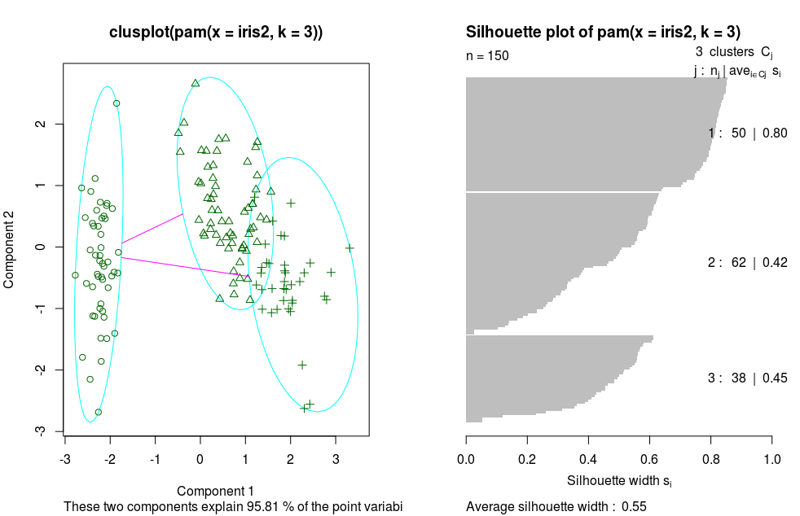
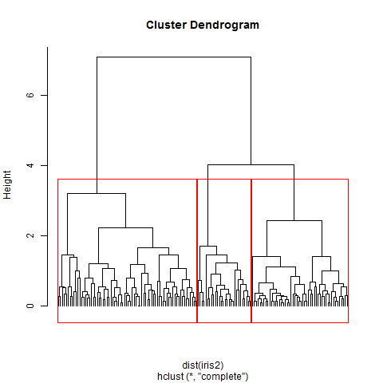
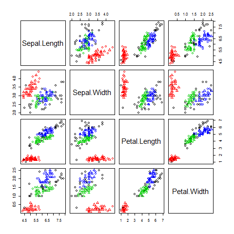
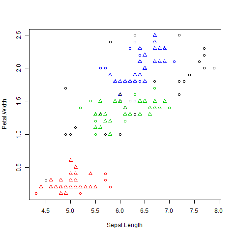

# Data Mining

## Clustering: k-medoids

Recordando k-means

``` R
> # repaso kmean
> # trabajo en una copia
> iris2 <- iris
> # vacio la variable objetivo
> iris2$Species <- NULL
> # armo el cluster y lo guardo en kmeans.result
> kmeans.result <- kmeans(iris2, 3)
> # comparo el resultado con el set original
> table(iris$Species, kmeans.result$cluster)
            
              1  2  3
  setosa     50  0  0
  versicolor  0 48  2
  virginica   0 14 36
> 
```

La especie *"setosa"* puede ser separado de los otros clusters, *"versicolor"* y *"virginica"* están bastante superpuestos.

``` R
> # graficamente
> plot(iris2[c("Sepal.Length", "Sepal.Width")], col = kmeans.result$cluster)
> # plot cluster centers
> points(kmeans.result$centers[,c("Sepal.Length", "Sepal.Width")], col = 1:3,pch = 8, cex=2)
> 
```


### k-medoids

En el algoritmo *k-means* un cluster es representado por su centro , en *k-medoids* por el objeto más cercano al centro.
*k-medoids* es más robusto cuando se tiene presencia de *outliers*.

Algoritmos para *k-medoids*: **PAM** (Partitioning Around Medoids), no es muy eficiente para grandes volúmenes. **CLARA** arma muestras y aplica PAM, mas eficiente.
Las funciones son **pam()** y **clara()** del paquete *cluster*.

**pamk()** incluida en el paquete *fpc*, no es necesario dar el número de clusters.

``` R
> # ejemplo con pamk() (deduce el numero optimo de clusters)
> library(fpc)
> pamk.result <- pamk(iris2)
> pamk.result$nc
[1] 2
```
Deduce 2 como numero de cluster. no good.

``` R
> table(pamk.result$pamobject$clustering, iris$Species)
   
    setosa versicolor virginica
  1     50          1         0
  2      0         49        50
> 
```
No puede distinguir bien entre *versicolor* y *virginica*.

``` R
> # graficamente
> layout(matrix(c(1,2),1,2)) # 2 graficos por pagina
> plot(pamk.result$pamobject)
> 
```


Como el valor promedio de *'Average silhouette width'* es de 0.81 para el primer cluster, el mismo está **bien identificado**.
No pasa lo mismo con el segundo cluster, con un valor promedio de *'Average silhouette width'* de 0.62, que es relativamente bajo. El segundo cluster está mucho más **mezclado**.

ahora usemos pam() indicando 3 clusters
``` R
> # ahora usemos pam() indicando 3 clusters
> library(cluster)
> pam.result <- pam(iris2, 3)
> table(pam.result$clustering, iris$Species)
   
    setosa versicolor virginica
  1     50          0         0
  2      0         48        14
  3      0          2        36
> layout(matrix(c(1,2),1,2)) # 2 graficos por pagina
> plot(pam.result)
> 
```


No es sencillo determinar cual de los dos métodos presentados es el mejor (sin saber de antemano el resultado!)
Siguiendo con el ejemplo de clustering, una buena práctica sería probar varias técnicas (y distintos parámetros para cada una de ellas) y luego promediar los resultados.

## Clustering jerárquico

Se parte de una matriz de distancias y se construye una jerarquia en base a esas distancias.

* **Aglomerativos (bottom up)** Comienza por los elementos individuales y los va agregando a grupos. Primero los dos que están mas *"cerca"*, los agrupa en un nuevo elemento, y así...
* **De division (top down)** Parte del total y lo ca subdividiendo. Divide primero en dos grupos tales que simultaneamente minimisan alguna distancia entre los miembros, y maximisa esa distancia con los del otro grupo, y así...

La funcio **hclust()** implementa la tecnica aglomerativa.

``` R
> # trabajo en una copia
> iris2 <- iris
> # vacio la variable objetivo
> iris2$Species <- NULL
```

``` R
> # armo el cluster y lo guardo en hc
> hc <- hclust(dist(iris2), method="complete")
> plot(hc, hang = -2, labels = FALSE)
> rect.hclust(hc, k=3)
```


``` R
> groups <- cutree(hc, k=3)
> table(iris$Species, groups)
            groups
              1  2  3
  setosa     50  0  0
  versicolor  0 23 27
  virginica   0 49  1
> 
```

## Clustering basado en densidad

La idea es agrupar objetos en un cluster si estos estanconectados mediante áreas densamente pobladas.

Vemos un ejemplo del algoritmo **DBSCAN**.

Hay dos parámetros importantes en DBSCAN: 1) *eps* tamaño de entorno, 2) *MinPts* número de puntos, si el número de puntos e nun entorno es mayor a MinPts entonces es un punto denso.

Todos los puntos en el entorno alcanzable por la densidad son puestos en el mismo cluster.

La ventaja de este método es que puede descubrir cluster de varias frmas y tamaños y no es sensible al ruido. (k-means tiende a encontrar clusters con forma de esfera y de tamaños similares)

``` R
> # install.packages("fpc")
> library(fpc)
> # requiere que la clase objetivo no este presente
> iris2 <- iris[-5]
```
``` R
> # genero los cluster y los comparo
> ds <- dbscan(iris2, eps=0.42, MinPts=5)
> table(ds$cluster, iris$Species)
   
    setosa versicolor virginica
  0      2         10        17
  1     48          0         0
  2      0         37         0
  3      0          3        33
```
La fila 0 son los valores identificados como *ruido* u *outliers*.

El **plot()** los muestra como circulos negros.

``` R
# grafico
> plot(ds, iris2)
> 
```


Notar que no le dije de antemano cuantos cluster hay. Bastante bien.

algunos subgraficos
``` R
> plot(ds, iris2[c(1,4)])
```


se pueden mostra los cluster con:
``` R
> plotcluster(iris2, ds$cluster)
> 
```


Lo interesante de esta tecnica es (i) es robusta y da buenos resultados (ii) no es necesario adelantar el numero de clusters (iii) tiene en cuenta los valores extremos y en lugar de 'ensuciar' decide no considerarlos.
